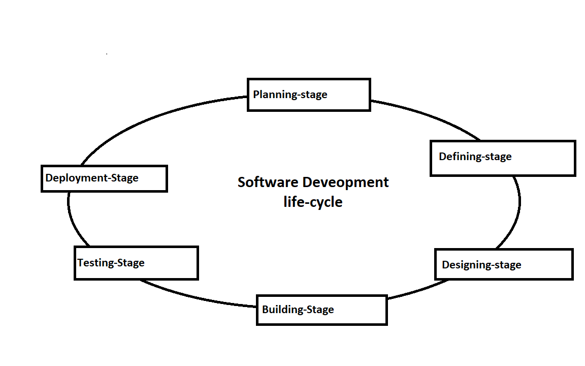

## WEB STACK IMPLEMENTATION (LAMP STACK) IN AWS

### What is SDLC

Software Development Life Cycle (SDLC) is a process used by the software industry to design, develop and test high quality softwares. The SDLC aims to produce a high-quality software that meets or exceeds customer expectations, reaches completion within times and cost estimates.  

A typical software Develpment Life-cycle consist of the following stages;  

-Planning  
-Defining  
-Designing  
-Building or Develompent  
-Testing  
-Deployment 

 

Now what is chmod and Chown?
