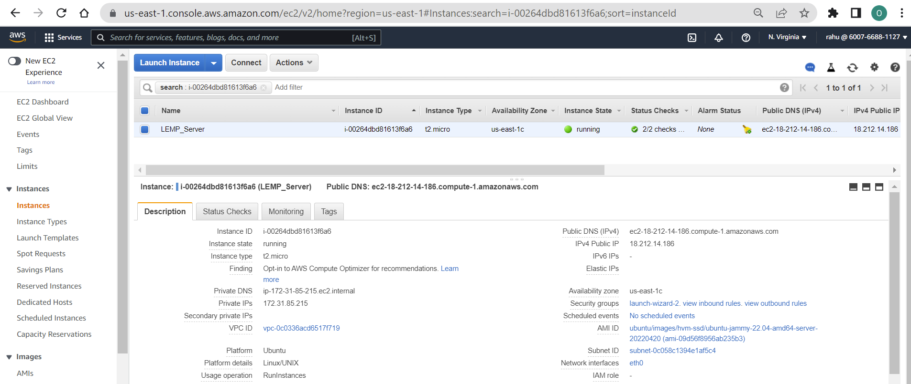
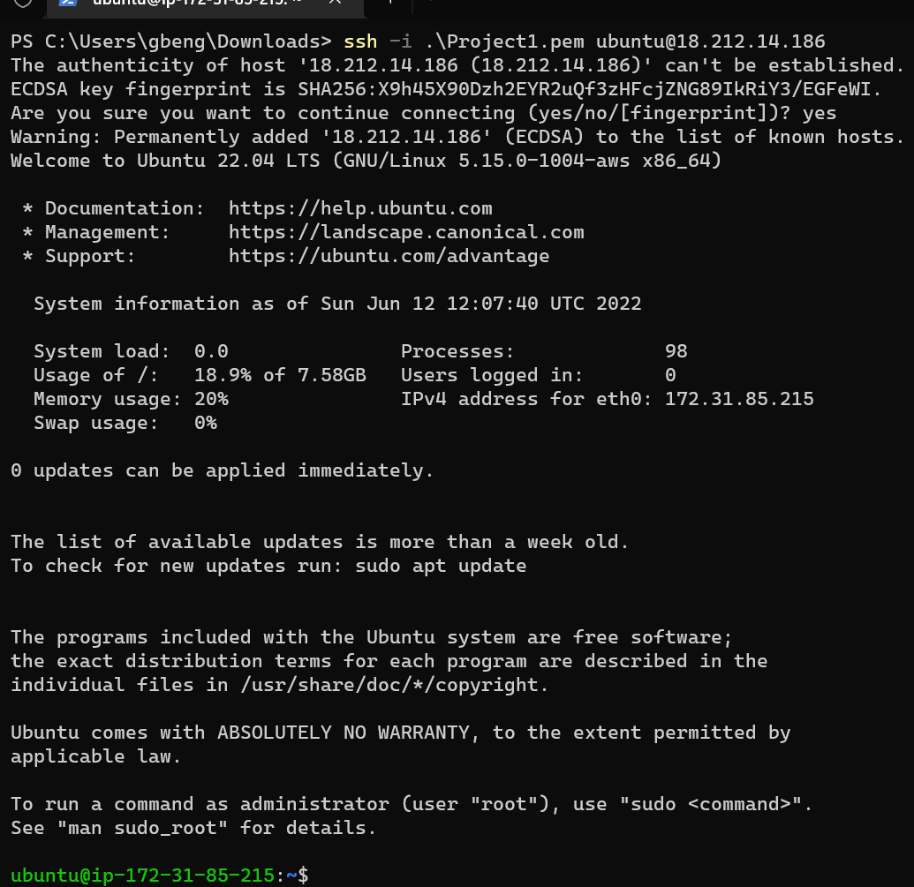
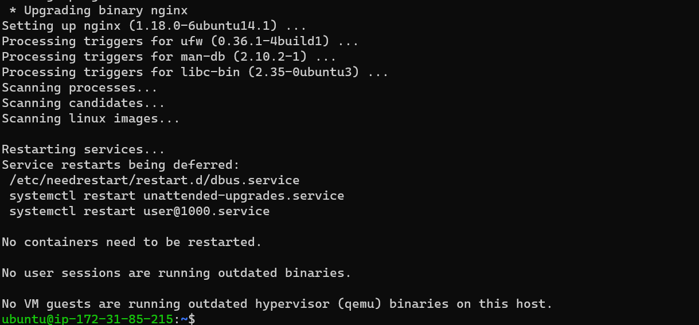
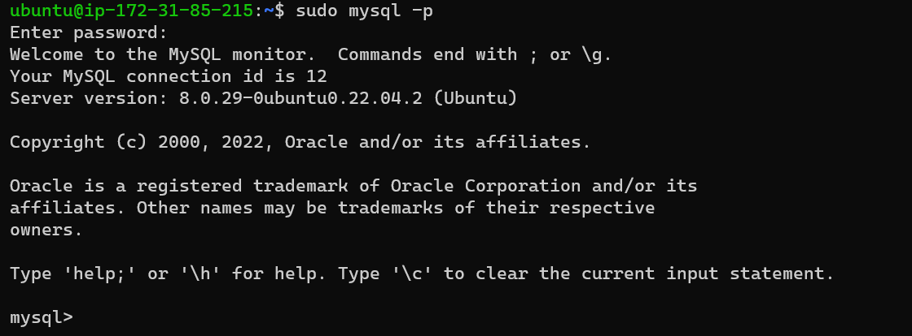
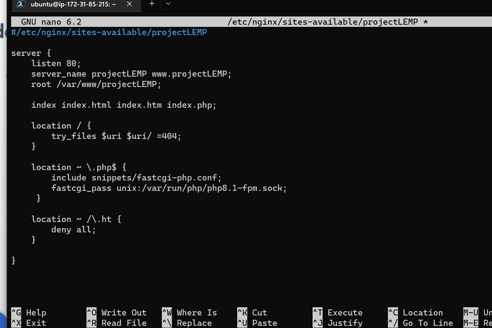
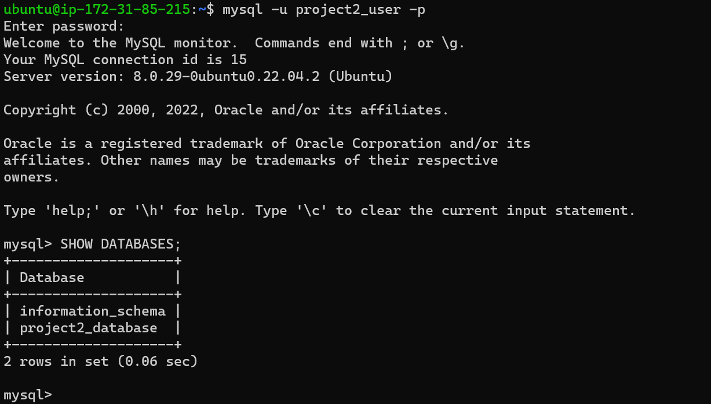
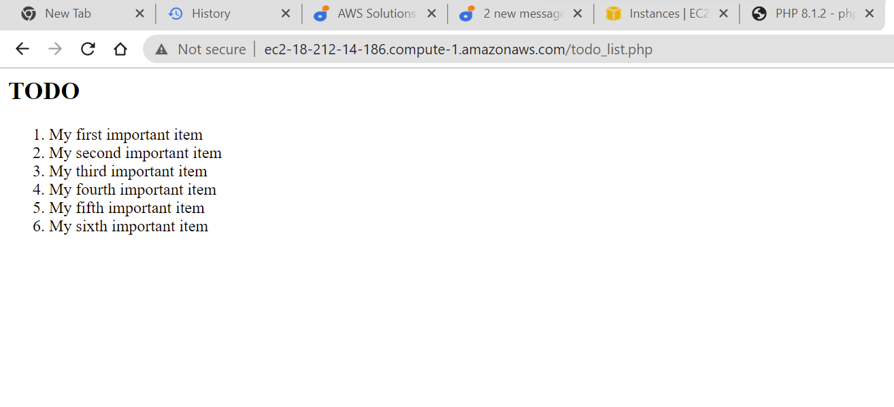

WEB STACK IMPLEMENTATION (LEMP STACK)

A virtual server with Ubuntu Server OS.

log in to the LEMP server created via windows terminal

STEP 1 – INSTALLING THE NGINX WEB SERVER

Updating Lemp server’s package index and installing NGINX
*sudo apt update and sudo apt install nginx* 

Needed to upgrade some packaged with command *sudo apt upgrade*

installed Nginx
  

  

Verify that nginx is successfully installed and is running as a service in Ubuntu, run: *sudo systemctl status nginx* 

Try access it locally and from the Internet using *curl http:localhost.com* and public ip of the LEMP 

STEP 2 — INSTALLING MYSQL
using the command *sudo apt install mysql-server*

log in to the MySQL console by typing:
*sudo mysql* 

update the root user Password 
  
Test the New root password to login.

  

STEP 3 – INSTALLING PHP
install php-fpm, which stands for “PHP fastCGI process manager”, and tell Nginx to pass PHP requests to this software for processing. Additionally, you’ll need php-mysql, a PHP module that allows PHP to communicate with MySQL-based databases

  

STEP 4 — CONFIGURING NGINX TO USE PHP PROCESSOR
1. Create the root web directory for your_domain as follows:

sudo mkdir /var/www/projectLEMP

Change ownership of the created directory from root to user

sudo chown -R $USER:$USER /var/www/projectLEMP

make new configuration file in Nginx’s sites-available directory  
*sudo nano /etc/nginx/sites-available/projectLEMP*   

  

make a link form Nginx site-enable to the newly configuration file created.
*sudo ln -s /etc/nginx/sites-available/projectLEMP /etc/nginx/sites-enabled/*  

sudo nginx -t
You shall see following message:

*nginx: the configuration file /etc/nginx/nginx.conf syntax is ok*  

*nginx: configuration file /etc/nginx/nginx.conf test is successful*

Disable default Nginx host that is currently configured in the site-enable directory with the command 

reload Nginx to apply the changes:

*sudo systemctl reload nginx*

  

Create an index.html file in that Root web location /var/www/projectLEMP using the script:

*sudo echo 'Hello LEMP from hostname' $(curl -s http://169.254.169.254/latest/meta-data/public-hostname) 'with public IP' $(curl -s http://169.254.169.254/latest/meta-data/public-ipv4) > /var/www/projectLEMP/index.html*  

 Access website URL using IP address or DNS will give same result..

   

STEP 5 – TESTING PHP WITH NGINX

creating a test PHP file in your document root directory to output infomation about your server.

*sudo nano /var/www/projectLEMP/info.php*

Then write a PhP script to outbut server details 

*<?php
phpinfo()*  

Access this page in your web browser by visiting the domain name or public IP which should give same page.

STEP 6 – RETRIEVING DATA FROM MYSQL DATABASE WITH PHP (CONTINUED)

login  to the database 

sudo mysql -p

Create a new database and new user and grant user full previllege

*CREATE DATABASE `project2_database`;*

*CREATE USER 'project2_user'@'%' IDENTIFIED WITH mysql_native_password BY 'your password';*

*GRANT ALL ON example_database.* TO 'example_user'@'%';*

Login to the created  Database and test if new user has access to database 

*mysql -u project2_user -p
*SHOW DATABASES;
this showed output
This will give you the following output:

Output
+--------------------+
| Database           |
+--------------------+
| example_database   |
| information_schema |
+--------------------+
2 rows in set (0.000 sec)

create a test table named todo_list
using the scrip below form mysql console

CREATE TABLE project2_database.todo_list (
     item_id INT AUTO_INCREMENT,
     content VARCHAR(255),
     PRIMARY KEY(item_id)
 );

create data into the table with the command 

INSERT INTO project2_database.todo_list (content) VALUES ("My first important item");

confirm that the data was successfully saved to your table, run:

SELECT * FROM project_database.todo_list;

Create a PHP script that will connect to MySQL and query for data in the DB
*nano /var/www/projectLEMP/todo_list.php*

check  the output of your PHP script by browsing to he page *http://<Public_domain_or_IP>/todo_list.php*
