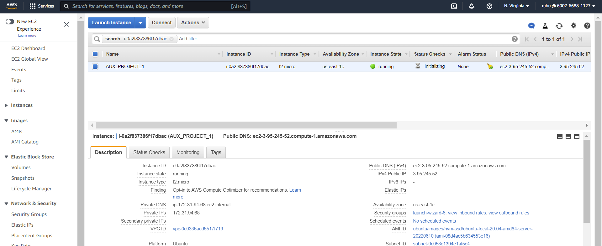
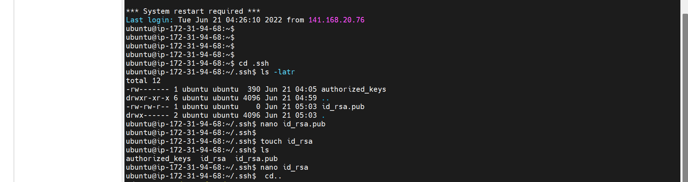
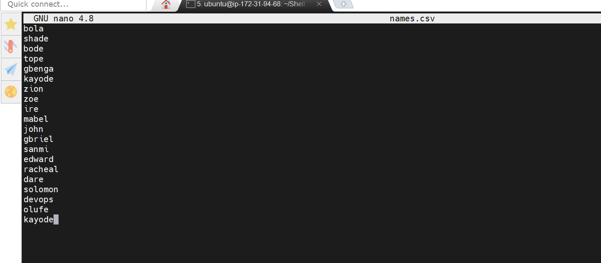
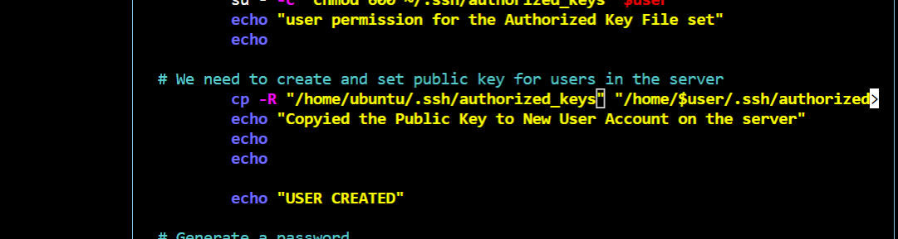
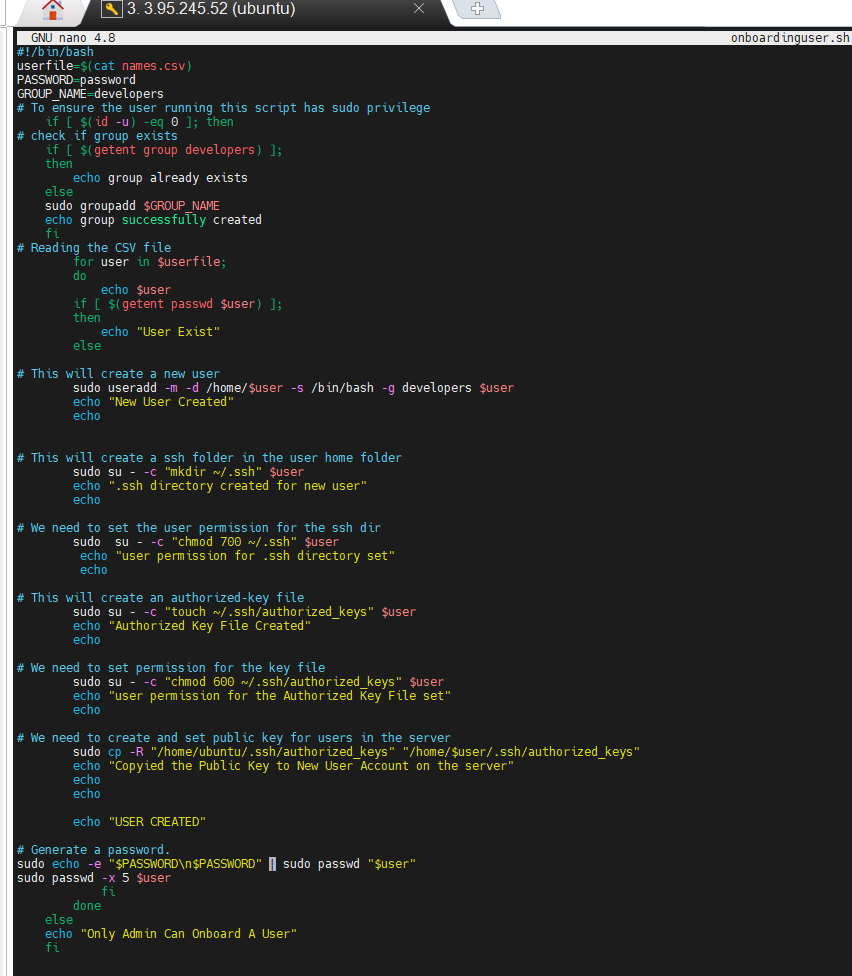
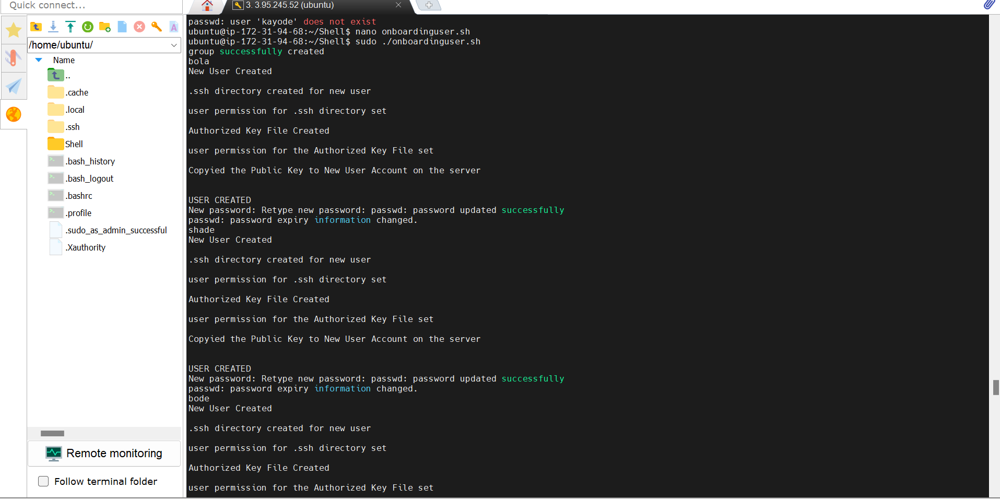
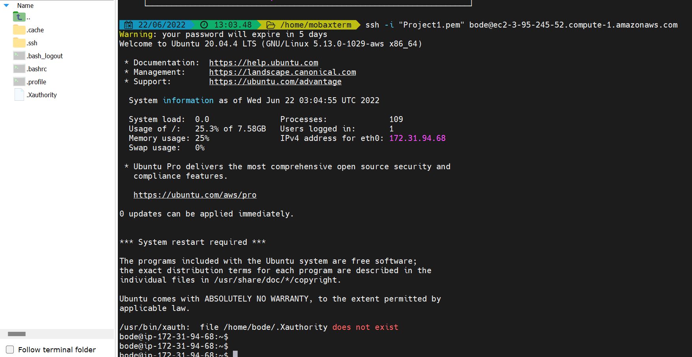

AUX PROJECT 1: SHELL SCRIPTING
Spinup a server instance in AWS and connect to it via SSH. Then  update the instance ready for implimentation.

1. Create the project folder called Shell  
`mkdir Shell`  
2. Move into the Shell folder  
`cd Shell`  
3. Create a csv file name names.csv  
`touch names.csv`  
4. Open the names.csv file  
`vim names.csv`  

Criterial for the script

1. The script you created should read the CSV file, create each user on the server, and add to an existing group called developers (You will need to manually create this group ahead).  

2. Ensure that your script will first check for the existence of the user on the system, before it will attempt to create that it.

3. Ensure that the user that is being created also has a default home folder

4. Ensure that each user has a .ssh folder within its HOME folder. If it does not exist, then create it.

5. For each user’s SSH configuration, create an authorized_keys file and add ensxure it has the public key of your current user.

Before Deploying your script, you will need to update your current user with the correct public key and private key.

- In your current home directory change directoy to **.ssh folder**  
  - cd .ssh  

**Note the instead of creating another or importing another public key you can actually access the public key of your current user on `/home/ubuntu/.ssh/authorized_keys` Hence you can skip below steps**

- create a file for the public key
  - touch id_rsa.pub

- Optional -Open the file using your favorite editor and paste in the public key
  - vi id_rsa.pub

- Optional -create a file for your private key
  - touch id_rsa
- Optional -Open the file using your favorite editor and paste in the private key.  
  - vi id_rsa

- Create your script whith the name onboardinguser.sh in the Shell directory.
  - nano onboardinguser.sh
- To create and set public key for users in the server
  - `sudo cp -R "/home/ubuntu/.ssh/authorized_keys" "/home/$user/.ssh/authorized_keys"`
  
  

- After runing script there was lot of error and the code need to be updated  

- Then run script in Shell directory
  - ./onbourdinguser.sh  

  

- Users created in home directory confirmation.

SSH to the instance using newly created user "bode"

