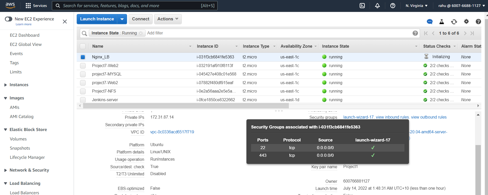
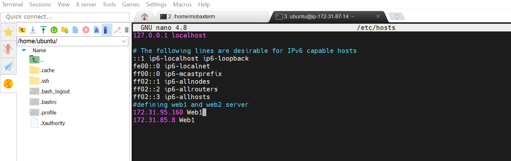
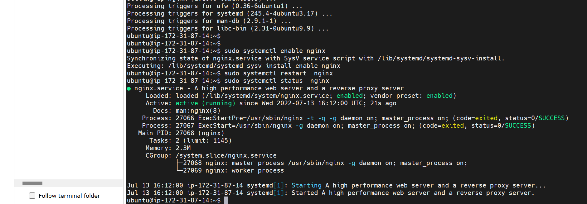
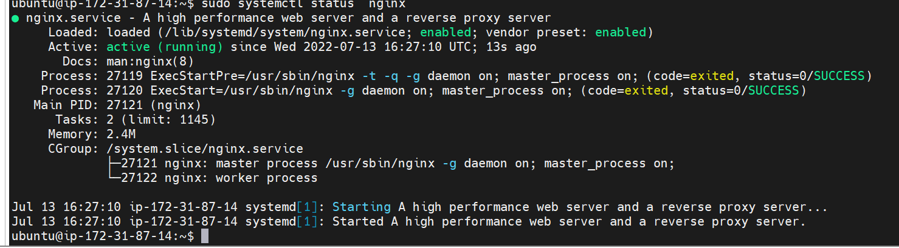
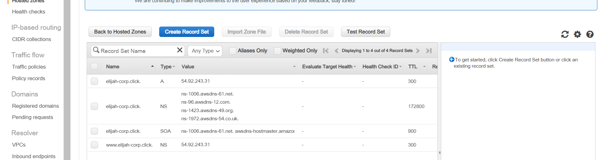
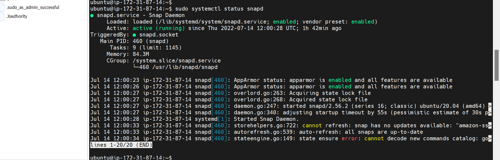
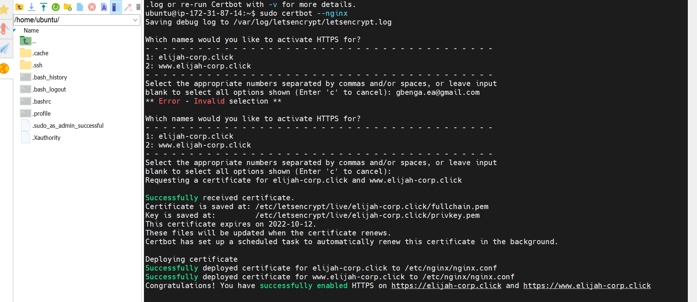
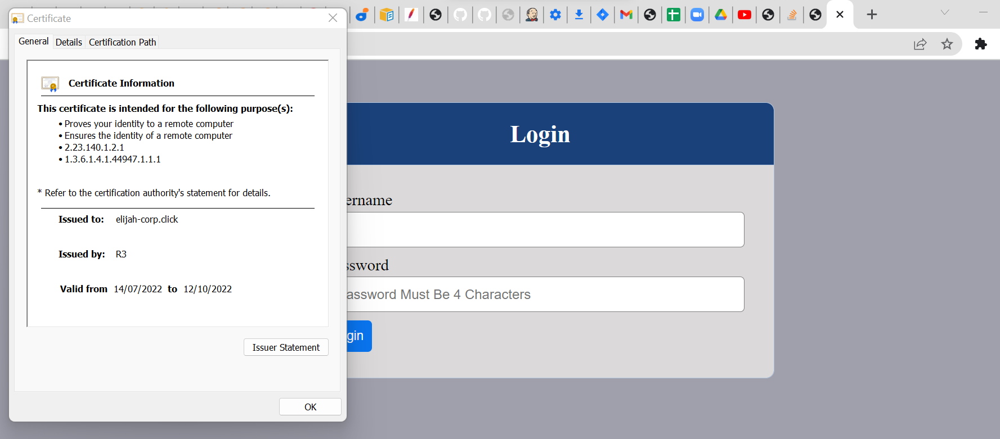
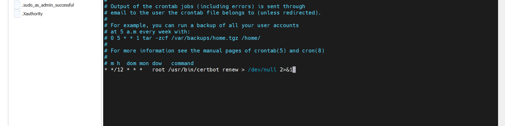

### LOAD BALANCER SOLUTION WITH NGINX AND SSL/TLS

Task
This project consists of two parts:  

Configure Nginx as a Load Balancer
Register a new domain name and configure secured connection using SSL/TLS certificates.

### CONFIGURE NGINX AS A LOAD BALANCER  

Either uninstall Apache from an existing apache2 Load Balancer server, or create a fresh installation of Linux for Nginx.

1. Create an EC2 VM based on Ubuntu Server 20.04 LTS and name it Nginx_LB 

2. Open TCP port 80 for HTTP connections, also open TCP port 443 which is used for secured HTTPS connections. 

  

3. Update /etc/hosts file for local DNS with Web Servers’ names (e.g. Web1 and Web2) and their local IP addresses
    - sudo nano /etc/hosts
    - update web1 

  

4. Install and configure Nginx as a load balancer to point traffic to the resolvable DNS names of the webservers.  
(i) Update the instance and Install Nginx  
    - sudo apt update
    - sudo apt upgrade
    - sudo apt install nginx  

  

5.  Configure Nginx LB using Web Servers’ names defined in /etc/hosts. Open the default nginx configuration file
    - sudo vi /etc/nginx/nginx.conf

```
#insert following configuration into http section

 upstream myproject {
    server Web1 weight=5;
    server Web2 weight=5;
  }

server {
    listen 80;
    server_name www.domain.com;
    location / {
      proxy_pass http://myproject;
    }
  }

#comment out this line
#       include /etc/nginx/sites-enabled/*;
```  

- Restart Nginx and make sure the service is up and running
    - sudo systemctl restart nginx
    - sudo systemctl status nginx

  


### REGISTER A NEW DOMAIN NAME AND CONFIGURE SECURED CONNECTION USING SSL/TLS CERTIFICATES  

1. Register a new domain name with any registrar of your choice in any domain zone (e.g. .com, .net, .org, .edu, .info, .xyz or any other)
    - register domain using AWS Route 53
    

2. Assign an Elastic IP to your Nginx LB server and 
    - instead of using an elastic IP for cost you can use the Public IP of the Nginx_LB(nginx loadbalancer)  

3. Associate your domain name with this Elastic IP
    - configure A records to associated your LB public Ip with domain name.
    - Check that your Web Servers can be reached from your browser using new domain name using HTTP protocol – http://<your-domain-name.com> 

 

4. Configure Nginx to recognize your new domain name
    - Update your nginx.conf with server_name www.<your-domain-name.com> instead of server_name www.domain.com 
  

5. Install certbot and request for an SSL/TLS certificate  

6. Make sure snapd service is active and running
    - sudo systemctl status snapd

  

8. Install certbot
    - sudo snap install --classic certbot  

9. Request your certificate  
    - sudo ln -s /snap/bin/certbot /usr/bin/certbot
    - sudo certbot --nginx  



10. Test secured access to your Web Solution by trying to reach https://<your-domain-name.com>  



11. Set up periodical renewal of your SSL/TLS certificate using cronjob.  
    - crontab -e
    - update file with below text * */12 * * *   root /usr/bin/certbot renew > /dev/null 2>&1  


