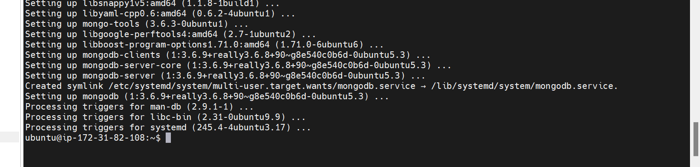

- Implement a simple Book Register web form using MEAN stack
- Step 0 Spin up an Ubuntu instance from AWS and SSH into it for access to the shell terminal.   

    

  

-   Step 1: Install
Node.js which is a JavaScript runtime built on Chrome’s V8 JavaScript engine.  
 Node.js will be used to set up the Express routes and AngularJS controllers.

- Update ubuntu
    - `sudo apt update`   
- Upgrade ubuntu
    - `sudo apt upgrade`

- Add certificates

    - `sudo apt -y install curl dirmngr apt-transport-https lsb-release ca-certificates`

    - `curl -sL https://deb.nodesource.com/setup_12.x | sudo -E bash -`  

- Install NodeJS
    -  `sudo apt install -y nodejs`  

    

-   Step 2: Install MongoDB
    - `sudo apt-key adv --keyserver hkp://keyserver.ubuntu.com:80 --recv 0C49F3730359A14518585931BC711F9BA15703C6`  

    - `echo "deb [ arch=amd64 ] https://repo.mongodb.org/apt/ubuntu trusty/mongodb-org/3.4 multiverse" | sudo tee /etc/apt/sources.list.d/mongodb-org-3.4.list`
- Install MongoDB`

    - `sudo apt install -y mongodb`   

- Start The server

    - ``sudo service mongodb start``  
- Verify that the service is up and running

    - `sudo systemctl status mongodb` 

- Install npm – Node package manager.
    - `sudo apt install -y npm`
- Install body-parser package {We need ‘body-parser’ package to help us process JSON files passed in requests to the server.}
    - sudo npm install body-parser

- Create a folder named ‘Books’ and change the working directory in to it.
    - mkdir Books && cd Books

- In the Books directory, Initialize npm project
    - npm init  

- Add a file to it named server.js
    - `vi server.js`

- Copy and paste the web server code below into the server.js file.

- Step 3: Install Express and set up routes to the server
    - sudo npm install express mongoose  

- In ‘Books’ folder, create a folder named apps

    - mkdir apps && cd apps  

- Create a file named routes.js
    - nano routes.js
- In the ‘apps’ folder, create a folder named models

    - mkdir models && cd models
- Create a file named book.js
    - vi book.js  

- Copy and paste the related code into ‘book.js’

- AngularJS provides a web framework for creating dynamic views in your web applications. In this tutorial, we use AngularJS to connect our web page with Express and perform actions on our book register.

- Change the directory back to ‘Books’  
    - cd ../..
- Create a folder named public
    - mkdir public && cd public
- Add a file named script.js
 - vi script.js
- Copy and paste the Code below (controller configuration defined) into the script.js file

- In public folder, create a file named index.html;
    - nano index.html  

- Change the directory back up to Books
    - cd ..
- Start the server by running this command:
    - node server.js   

  

- The server is now up and running, we can connect it via port 3300. You can launch a separate Putty or SSH console to test what curl command returns locally.

- Note while creating the index.html I made a mistake and created *indext.html. I got an error when starting my server but i was able to figure it out and renamed the file indext.html to index.html.  

-   curl -s http://localhost:3300

- Open TCP port 3300 in your AWS Web Console for your EC2 Instance.  

-   This is the Web Book Register Application form the web browser  

