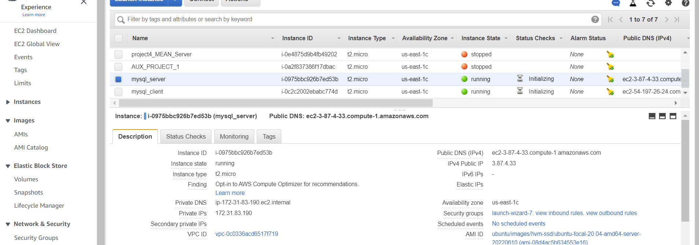
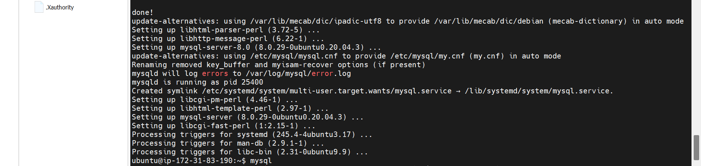
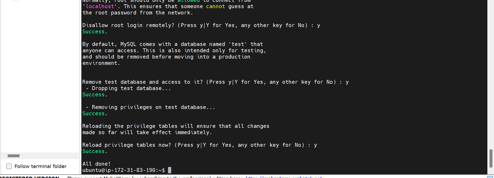
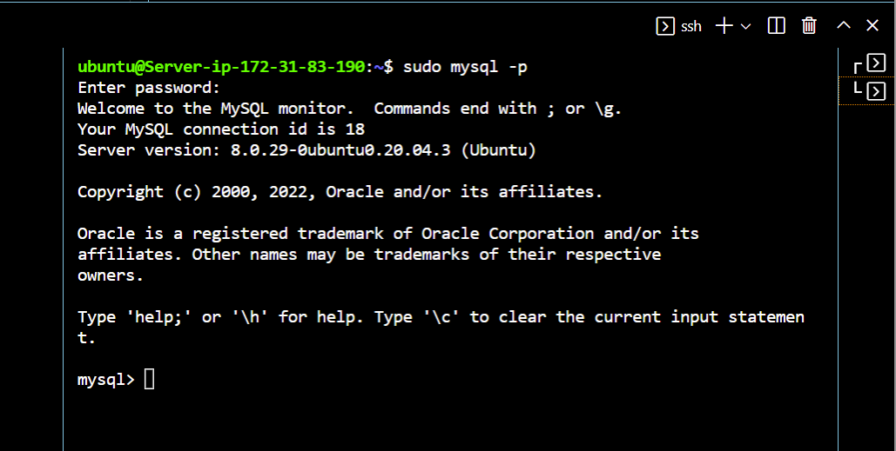
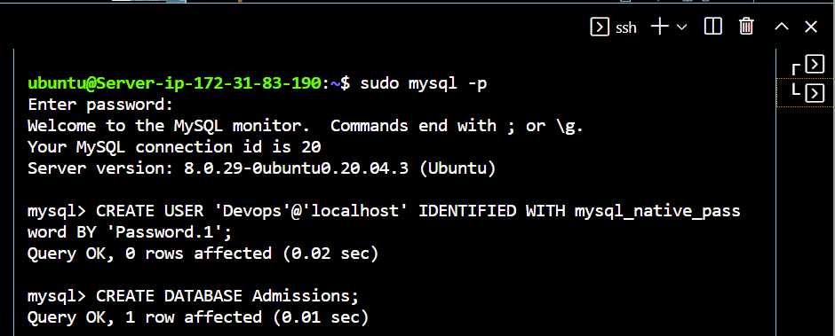
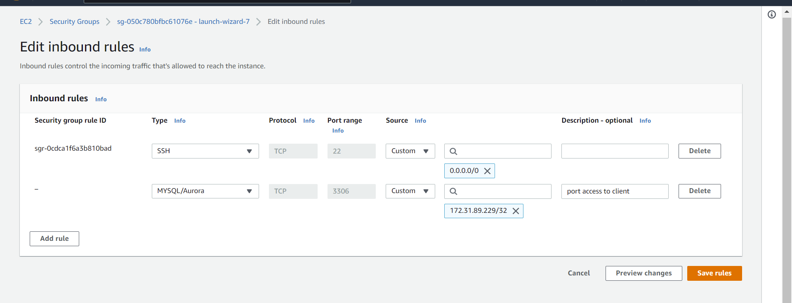
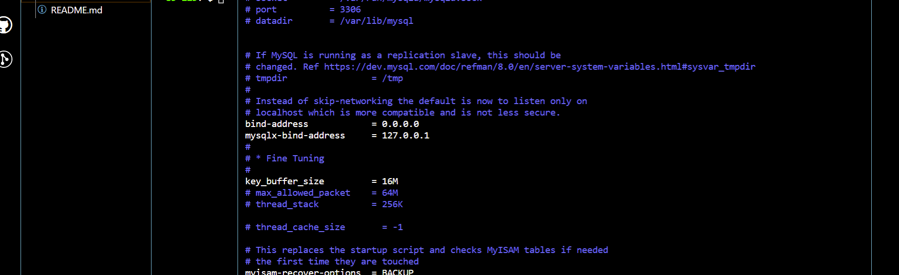
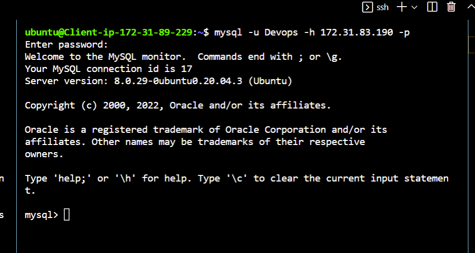
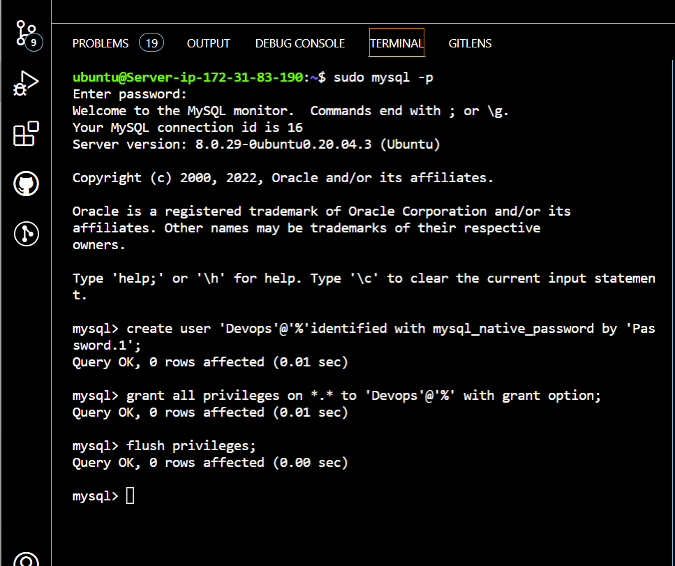
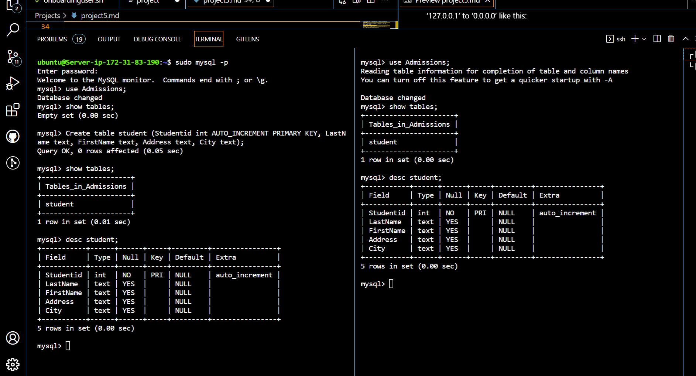

IMPLEMENT A CLIENT SERVER ARCHITECTURE USING MYSQL DATABASE MANAGEMENT SYSTEM (DBMS).

TASK – Implement a Client Server Architecture using MySQL Database Management System (DBMS).
To demonstrate a basic client-server using MySQL Relational Database Management System (RDBMS), follow the below instructions
1. Create and configure two Linux-based virtual servers (EC2 instances in AWS).
Server A name - `mysql server`
Server B name - `mysql client`

2. On mysql server Linux Server install MySQL Server software .Interesting fact: MySQL is an open-source relational database management system. Its name is a combination of "My", the name of co-founder Michael Widenius’s daughter, and "SQL", the abbreviation for Structured Query Language.

3. Then you need to activate the root user password wirth the code 
`ALTER USER 'root'@'localhost' IDENTIFIED WITH mysql_native_password BY 'PassWord.1';` then you exit the mysql console. 
 

Next start the defualt script to configure your database for minimal security setup by running the code on your terminal `sudo mysql_secure_installation` follow the prompts to set up you DB.   
To get back into the console of mysql run command on terminal `sudo mysql -p` enter your mysql root user password when prompted. 
  

Create a new Mysql user so you dont risk getting you root user compromised using the code `CREATE USER 'new_user'@'localhost' IDENTIFIED WITH mysql_native_password BY 'PassWord.newuser';`  
You can also create a Database with the command `CREATE DATABASE Database_name;` you will also need at list a table in your database to start storing and manipulating your data. run command `CREATE TABLE table_name(column1 datatype,column2 datatype,column3 datatype,....);` 

On mysql client Linux Server install MySQL Client software. Then use mysql server's local IP address to connect from mysql client. MySQL server uses TCP port 3306 by default, so you will have to open it by creating a new entry in ‘Inbound rules’ in ‘mysql server’ Security Groups.   
For extra security, do not allow all IP addresses to reach your ‘mysql server’ – allow access only to the specific local IP address of your ‘mysql client’.

You might need to configure MySQL server to allow connections from remote hosts. 
sudo vi /etc/mysql/mysql.conf.d/mysqld.cnf
Replace ‘127.0.0.1’ to ‘0.0.0.0’ like this:
  

From mysql client Linux Server connect remotely to mysql server Database Engine without using SSH. You must use the mysql utility to perform this action.

create user on mysql server and assigne privilleges to the newly ceated user

Check that you have successfully connected to a remote MySQL server and can perform SQL queries:

Show databases on both mysql-cleint and mysql-server

