Project 6 consists of two parts

Configure storage subsystem for Web and Database servers based on Linux OS. The focus of this part is to give you practical experience of working with disks, partitions and volumes in Linux.

Install WordPress and connect it to a remote MySQL database server. This part of the project will solidify your skills of deploying Web and DB tiers of Web solution.

As a DevOps engineer, your deep understanding of core components of web solutions and ability to troubleshoot them will play essential role in your further progress and development.

Three-tier Architecture
Generally, web, or mobile solutions are implemented based on what is called the Three-tier Architecture.

Three-tier Architecture is a client-server software architecture pattern that comprise of 3 separate layers.

Presentation Layer (PL): This is the user interface such as the client server or browser on your laptop.
Business Layer (BL): This is the backend program that implements business logic. Application or Webserver
Data Access or Management Layer (DAL): This is the layer for computer data storage and data access. Database Server or File System Server such as FTP server, or NFS Server

Step 1 — Prepare a Web Server Launch an EC2 instance that will serve as "Web Server".
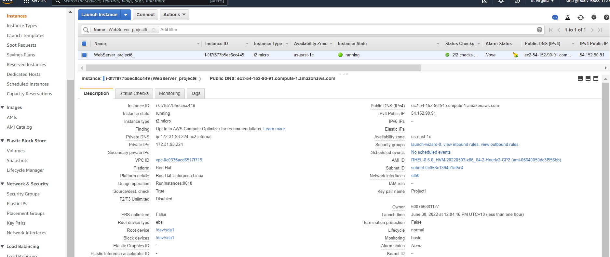

- Create 3 volumes in the same AZ as your Web Server EC2, each of 10 GiB.  

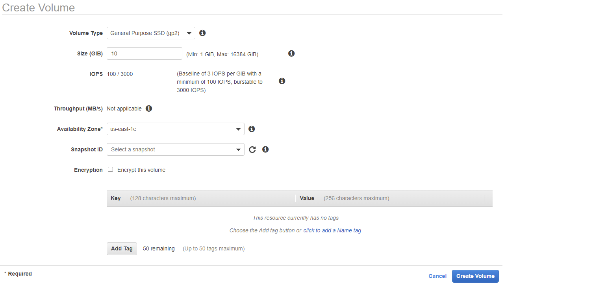
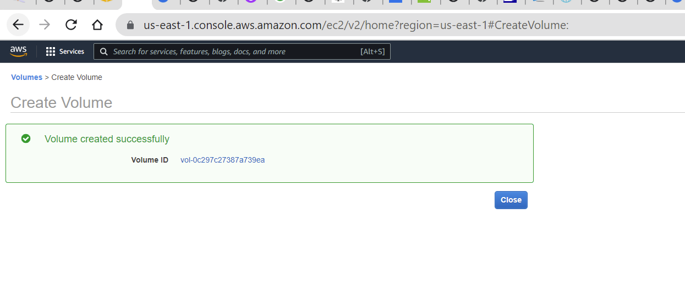  

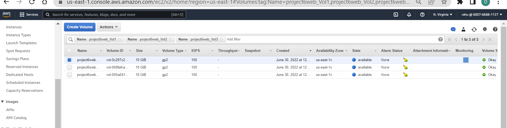

- Attach all three volumes one by one to your Web Server EC2 instance 

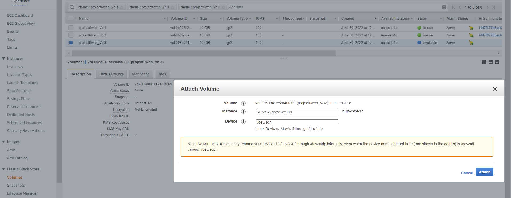
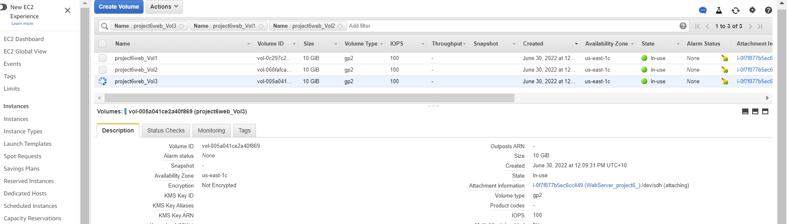

- Open up the Linux terminal to begin configuration

- Use lsblk command to inspect what block devices are attached to the server. Notice names of your newly created devices. All devices in Linux reside in /dev/ directory. Inspect it with ls /dev/ and make sure you see all 3 newly created block devices there – their names will likely be xvdf, xvdh, xvdg.
- Use df -h command to see all mounts and free space on your server

- 
- Use `gdisk` utility or `cfdisk` to create a single partition on each of the 3 disks.  
    - sudo gdisk volume path  
    - sudo cfdisk /volume path
steps for partition using cfdislk
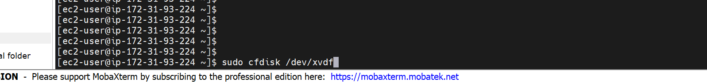
  
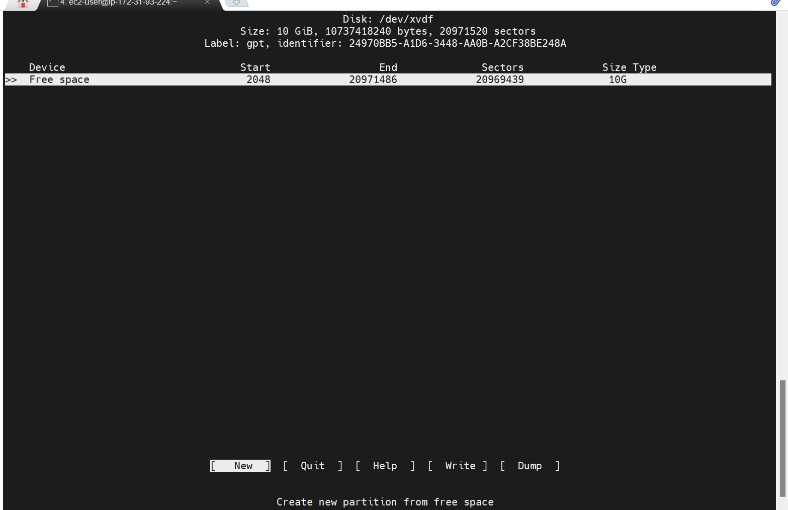
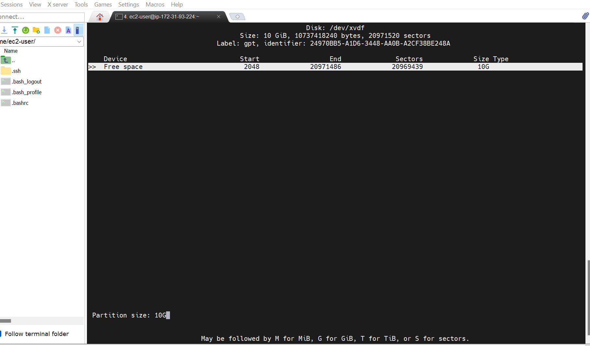
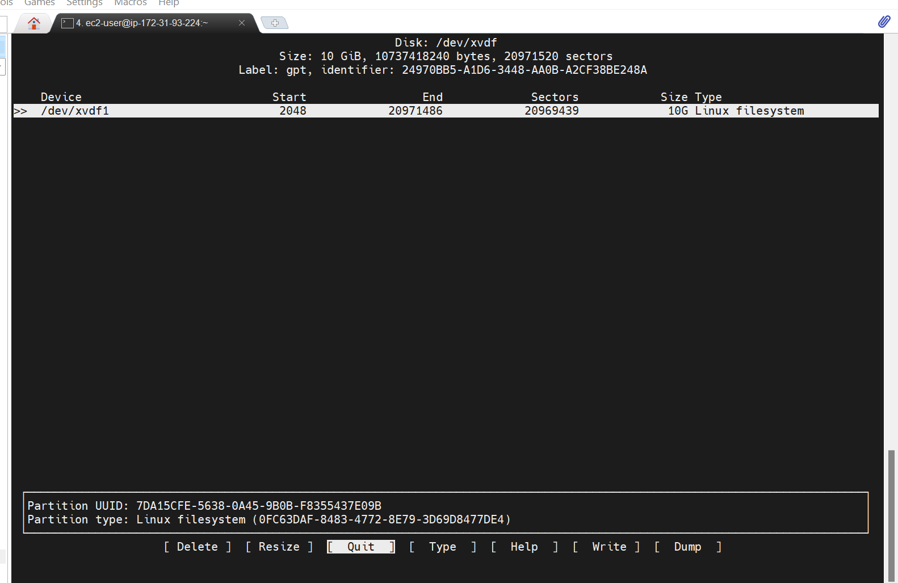

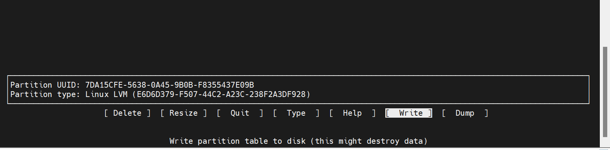
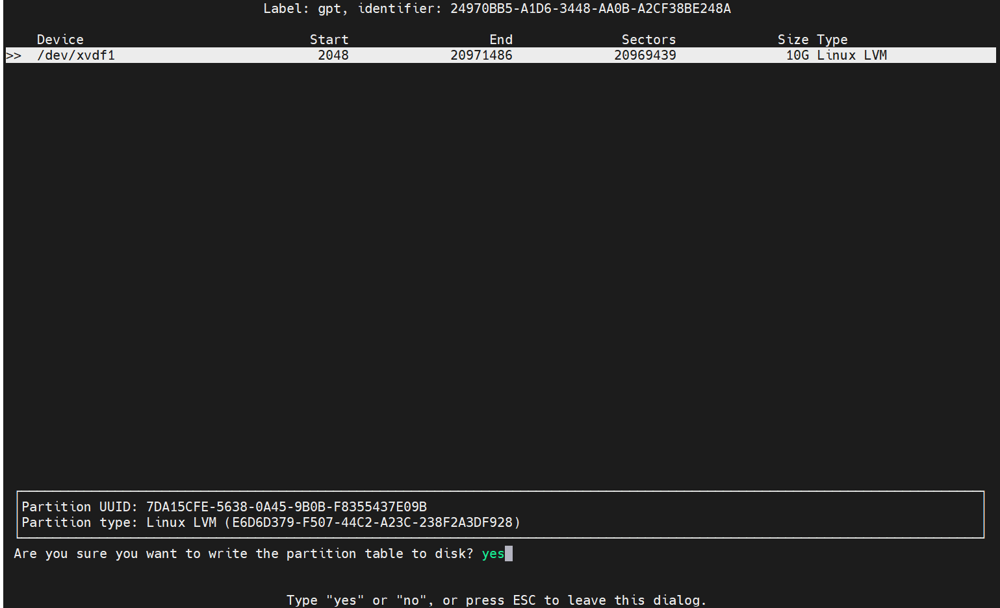

Steps for patition using gdisk
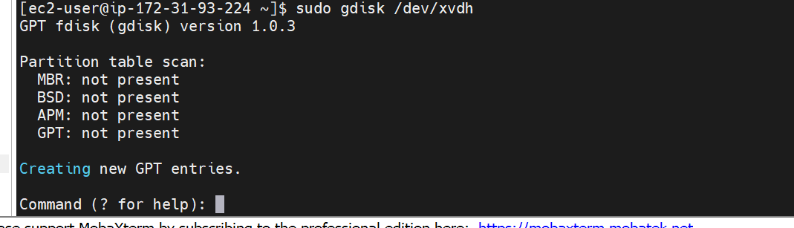
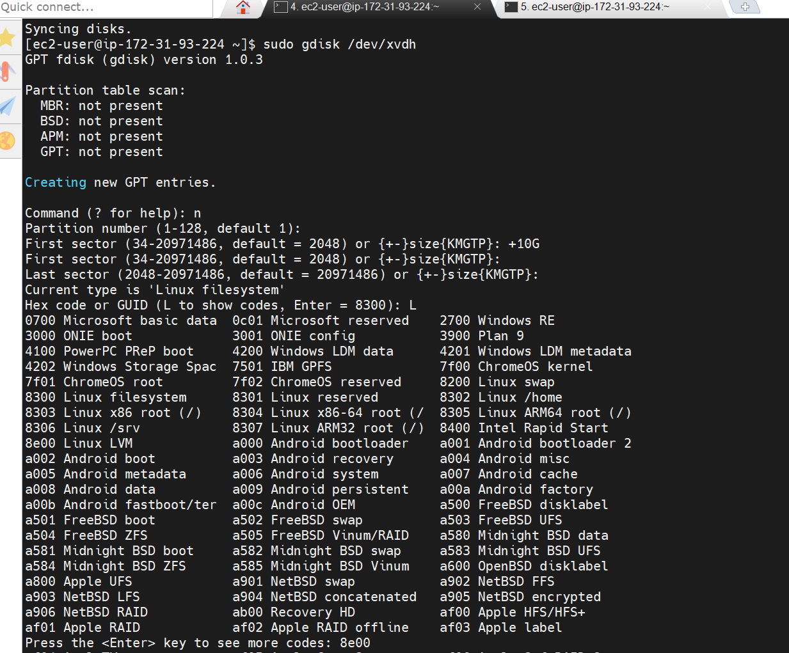
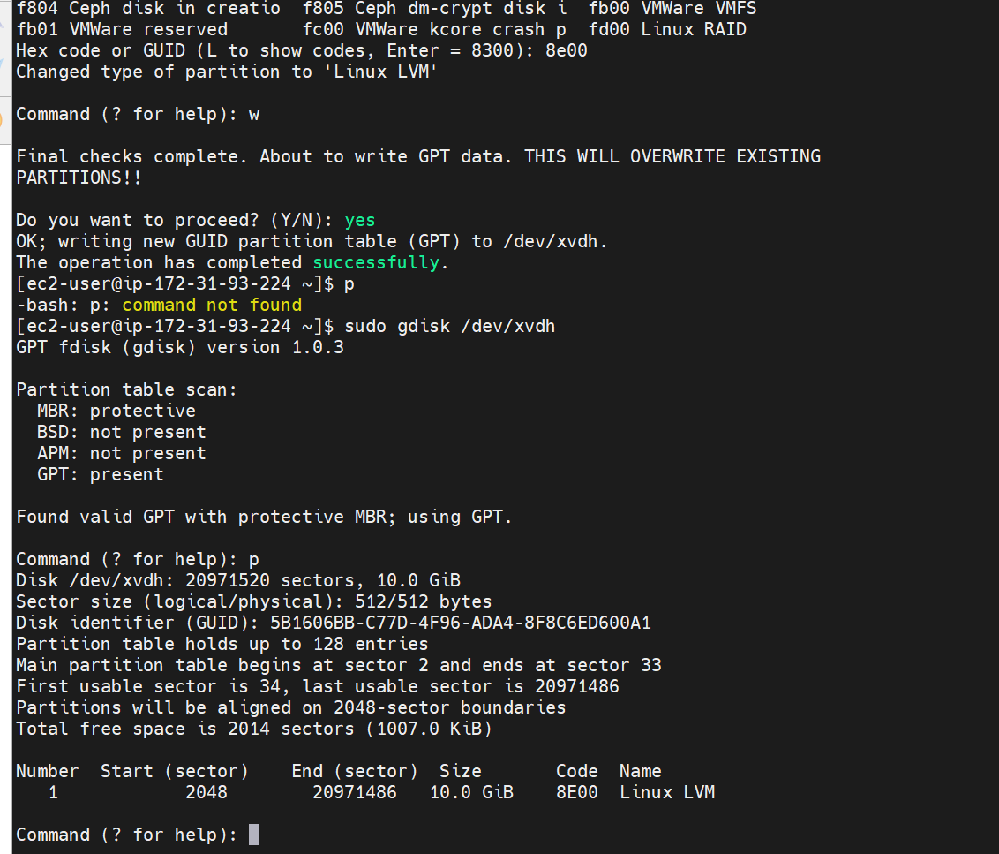
