Project 6 consists of two parts

Configure storage subsystem for Web and Database servers based on Linux OS. The focus of this part is to give you practical experience of working with disks, partitions and volumes in Linux.

Install WordPress and connect it to a remote MySQL database server. This part of the project will solidify your skills of deploying Web and DB tiers of Web solution.

As a DevOps engineer, your deep understanding of core components of web solutions and ability to troubleshoot them will play essential role in your further progress and development.

Three-tier Architecture
Generally, web, or mobile solutions are implemented based on what is called the Three-tier Architecture.

Three-tier Architecture is a client-server software architecture pattern that comprise of 3 separate layers.

Presentation Layer (PL): This is the user interface such as the client server or browser on your laptop.
Business Layer (BL): This is the backend program that implements business logic. Application or Webserver
Data Access or Management Layer (DAL): This is the layer for computer data storage and data access. Database Server or File System Server such as FTP server, or NFS Server

Step 1 — Prepare a Web Server Launch an EC2 instance that will serve as "Web Server".

- Create 3 volumes in the same AZ as your Web Server EC2, each of 10 GiB.  

  

- Attach all three volumes one by one to your Web Server EC2 instance 

- Open up the Linux terminal to begin configuration

- Use lsblk command to inspect what block devices are attached to the server. Notice names of your newly created devices. All devices in Linux reside in /dev/ directory. Inspect it with ls /dev/ and make sure you see all 3 newly created block devices there – their names will likely be xvdf, xvdh, xvdg.
- Use df -h command to see all mounts and free space on your server
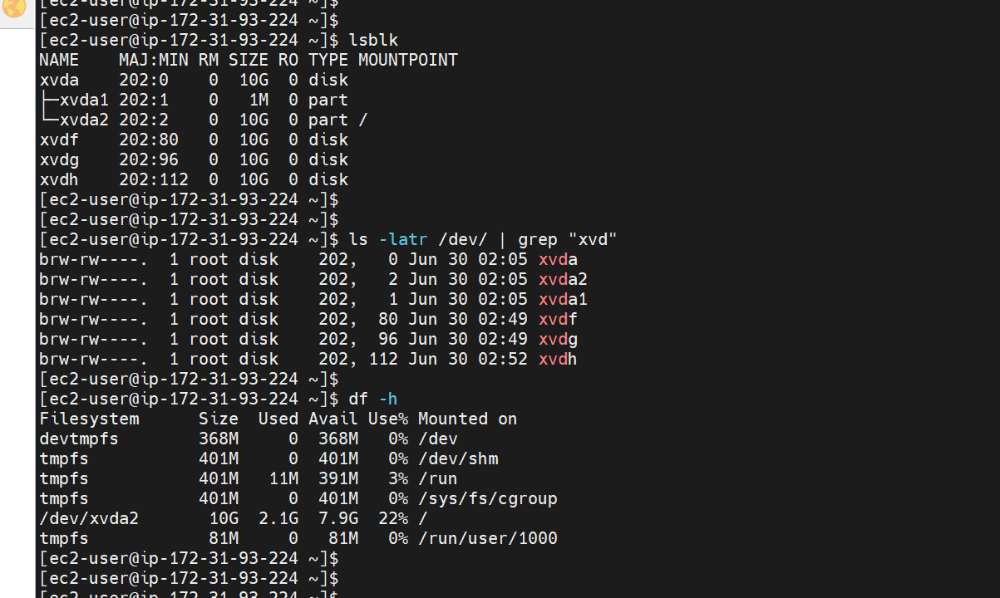  

- Use `gdisk` utility or `cfdisk` to create a single partition on each of the 3 disks.  
    - sudo gdisk volume path  
    - sudo cfdisk /volume path  

steps for partition using cfdislk  

 

Steps for patition using gdisk
  

  

- Use lsblk utility to view the newly configured partition on each of the 3 disks.

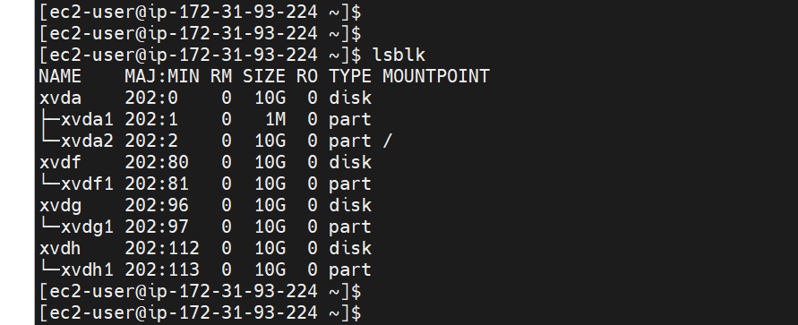

- Install lvm2 package using sudo yum install lvm2. Run sudo lvmdiskscan command to check for available partitions.

- Use pvcreate utility to mark each of 3 disks as physical volumes (PVs) to be used by LVM
	- `sudo pvcreate /dev/xvdf1`
	- `sudo pvcreate /dev/xvdg1`
	- `sudo pvcreate /dev/xvdh1`
- Verify that your Physical volume has been created successfully by running sudo pvs
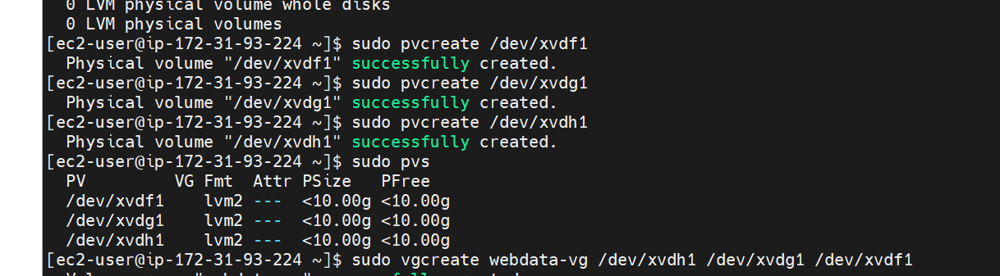

- Use vgcreate utility to add all 3 PVs to a volume group (VG). Name the VG webdata-vg
	- `sudo vgcreate webdata-vg /dev/xvdh1 /dev/xvdg1 /dev/xvdf1`
- Verify that your VG has been created successfully by running `sudo vgs`
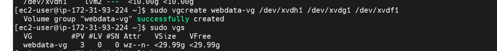

- Use lvcreate utility to create 2 logical volumes. apps-lv (Use half of the PV size), and logs-lv Use the remaining space of the PV size. NOTE: apps-lv will be used to store data for the Website while, logs-lv will be used to store data for logs.
	- `sudo lvcreate -n apps-lv -L 14G webdata-vg'`
	- `sudo lvcreate -n logs-lv -L 14G webdata-vg`
- Verify that your Logical Volume has been created successfully by running `sudo lvs`

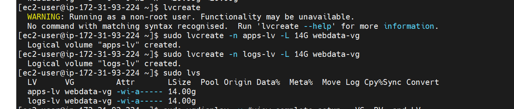
- Verify the entire setup with the below commands
	- `sudo vgdisplay -v` {view complete setup - VG, PV, and LV}
	- `sudo lsblk`  

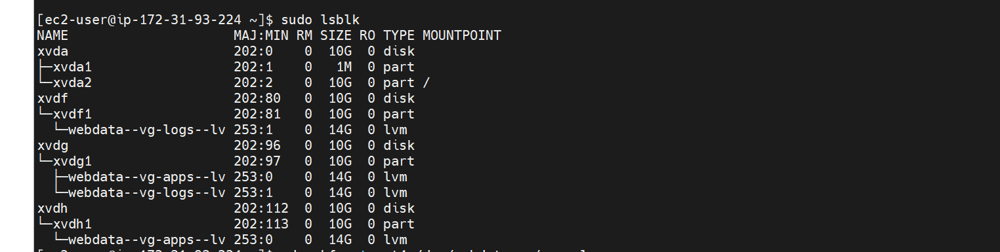

- Use mkfs.ext4 to format the logical volumes with ext4 filesystem
	- `sudo mkfs -t ext4 /dev/webdata-vg/apps-lv`
	- `sudo mkfs -t ext4 /dev/webdata-vg/logs-lv`
- Create /var/www/html directory to store website files
	- `sudo mkdir -p /var/www/html`

- Create /home/recovery/logs to store backup of log data

	- `sudo mkdir -p /home/recovery/logs`

- Mount /var/www/html on apps-lv logical volume
	- `sudo mount /dev/webdata-vg/apps-lv /var/www/html/`

- Use rsync utility to backup all the files in the log directory /var/log into /home/recovery/logs (This is required before mounting the file system)
	- `sudo rsync -av /var/log/. /home/recovery/logs/`
- Mount /var/log on logs-lv logical volume. (Note that all the existing data on /var/log will be deleted. That is why step 15 above is very
important)
	- `sudo mount /dev/webdata-vg/logs-lv /var/log`
- Restore log files back into /var/log directory
	- `sudo rsync -av /home/recovery/logs/. /var/log`
	
- Update /etc/fstab file so that the mount configuration will persist after restart of the server. The UUID of the device will be used to update the /etc/fstab file;
	- `sudo blkid`
	- `sudo vi /etc/fstab`

- Update /etc/fstab in this format using your own UUID and rememeber to remove the leading and ending quotes.
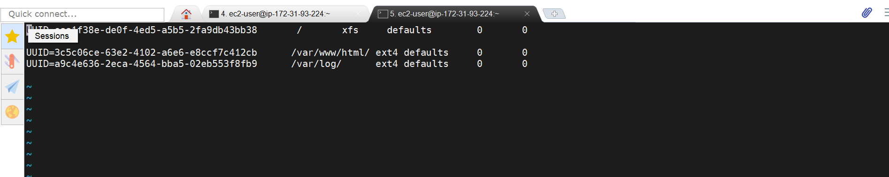
- Test the configuration and reload the daemon
	- `sudo mount -a`
	- `sudo systemctl daemon-reload`

- Verify your setup by running df -h, output must look like this:
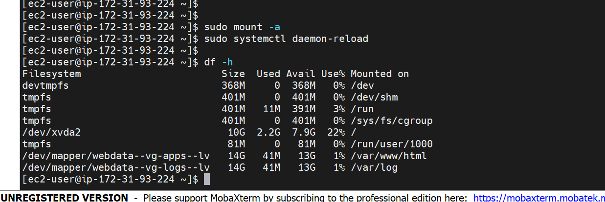

- Step 2 — Prepare the Database Server
Launch a second RedHat EC2 instance that will have a role – ‘DB Server’
Repeat the same steps as for the Web Server, but instead of apps-lv create db-lv and mount it to /db directory instead of /var/www/html/  

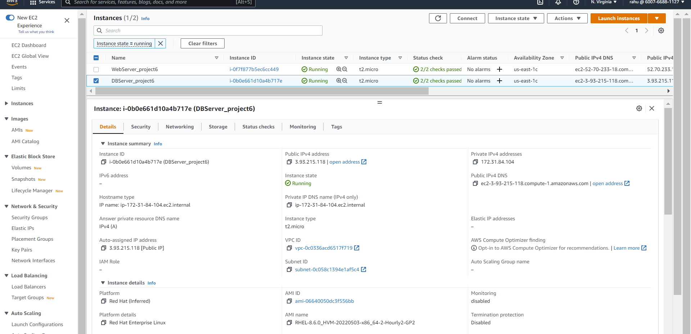
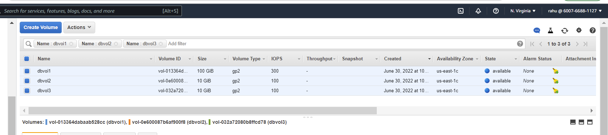
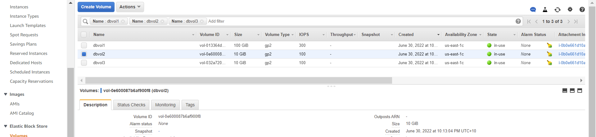
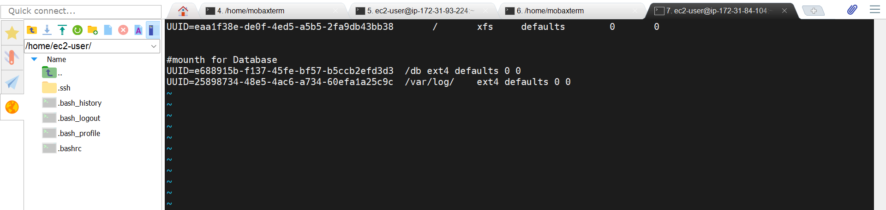
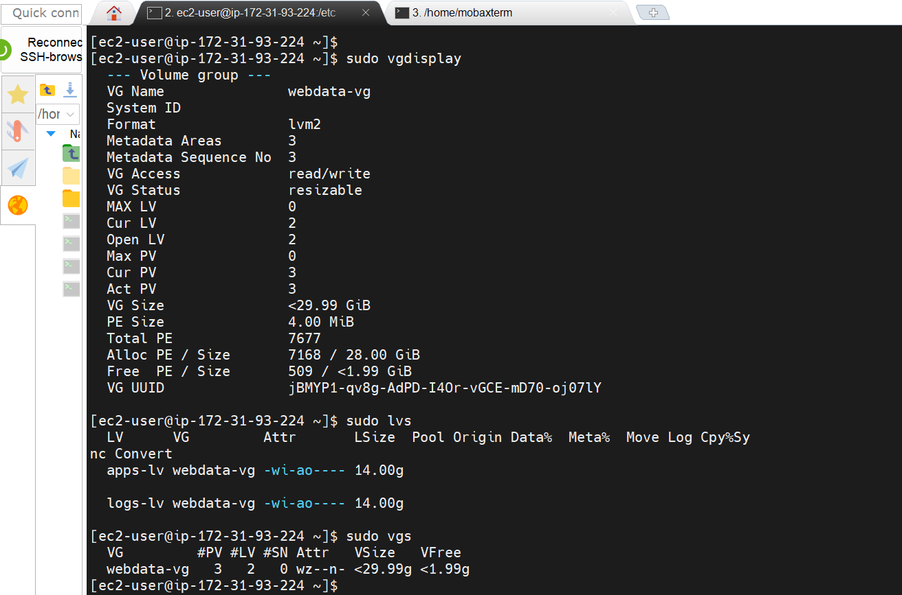

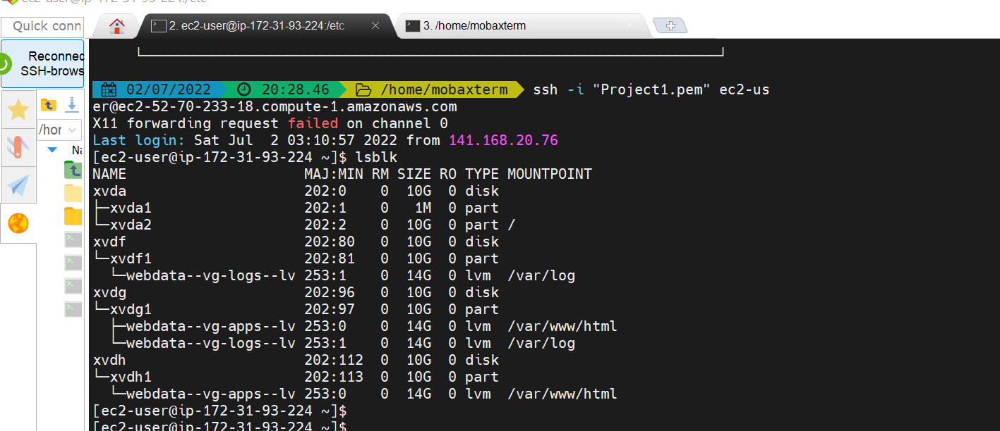

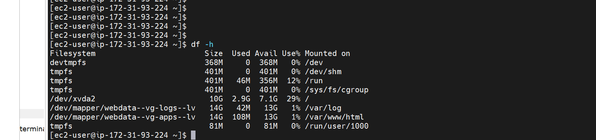
- Step 3 — Install WordPress on your Web Server EC2
- Update the repository
    - sudo yum -y update
- Install wget, Apache and it’s dependencies
    - sudo yum -y install wget httpd php php-mysqlnd php-fpm php-json
- Start Apache
    - sudo systemctl enable httpd
    - sudo systemctl start httpd

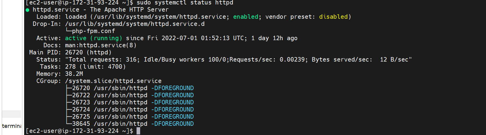 

- To install PHP and it’s depemdencies
    - sudo yum install https://dl.fedoraproject.org/pub/epel/epel-release-latest-8.noarch.rpm
    - sudo yum install yum-utils http://rpms.remirepo.net/enterprise/remi-release-8.rpm
    - sudo yum module list php
    - sudo yum module reset php
    - sudo yum module enable php:remi-7.4
    - sudo yum install php php-opcache php-gd php-curl php-mysqlnd
    - sudo systemctl start php-fpm
    - sudo systemctl enable php-fpm
    - sudo setsebool -P httpd_execmem 1
- Restart Apache
    - sudo systemctl restart httpd

- Download wordpress and copy wordpress to var/www/html
    - no need to run command(mkdir wordpress)
    - no need to run command(cd   wordpress)
    - sudo wget http://wordpress.org/latest.tar.gz
    - sudo tar xzvf latest.tar.gz
    - sudo rm -rf latest.tar.gz
    - cp wordpress/wp-config-sample.php wordpress/   wp-config.php
    - cp -R wordpress /var/www/html/
- Configure SELinux Policies
    - sudo chown -R apache:apache /var/www/html/wordpress
    - sudo chcon -t httpd_sys_rw_content_t /var/www/html/wordpress -R
    - sudo setsebool -P httpd_can_network_connect=1  

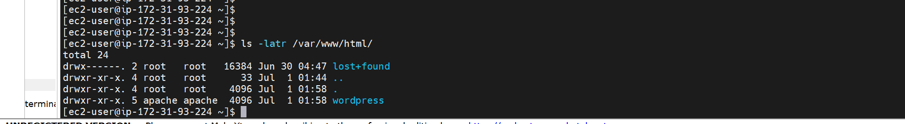
- Step 4 — Install MySQL on your DB Server EC2
    - sudo yum update
    - sudo yum install mysql-server
- Verify that the service is up and running by using sudo systemctl status mysqld, if it is not running, restart the service and enable it so it will be running even after reboot:
    - sudo systemctl restart mysqld
    - sudo systemctl enable mysqld

    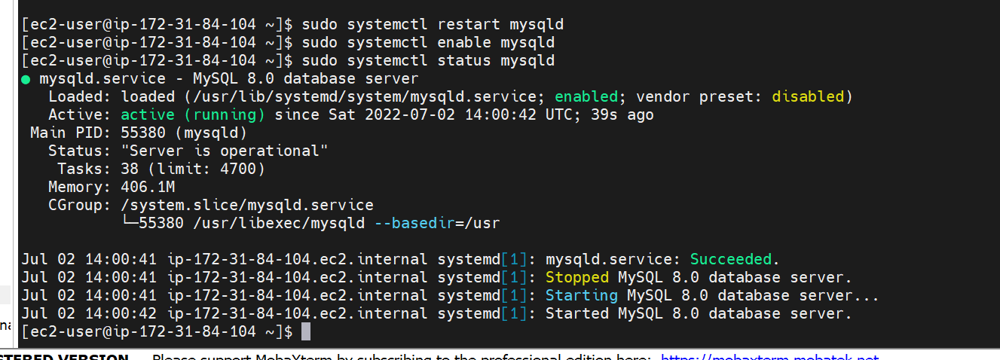
- Step 5 — Configure DB to work with WordPress
    - sudo mysql
    - CREATE DATABASE wordpress;
    - CREATE USER `myuser`@`<Web-Server-Private-IP-Address>` IDENTIFIED BY 'mypass';
    - GRANT ALL ON wordpress.* TO 'myuser'@'<Web-Server-Private-IP-Address>';
    - FLUSH PRIVILEGES;
    -SHOW DATABASES;
    - exit  
- Step 6 — Configure WordPress to connect to remote database.

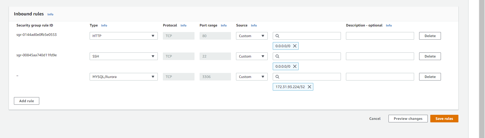

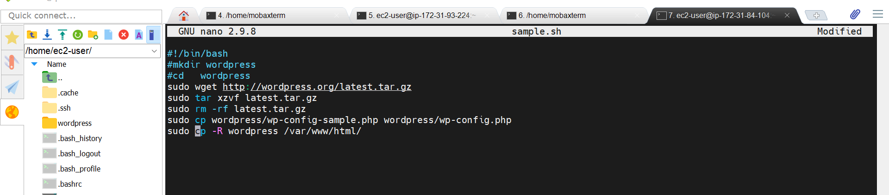
Hint: Do not forget to open MySQL port 3306 on DB Server EC2. For extra security, you shall allow access to the DB server ONLY from your Web Server’s IP address, so in the Inbound Rule configuration specify source as /32

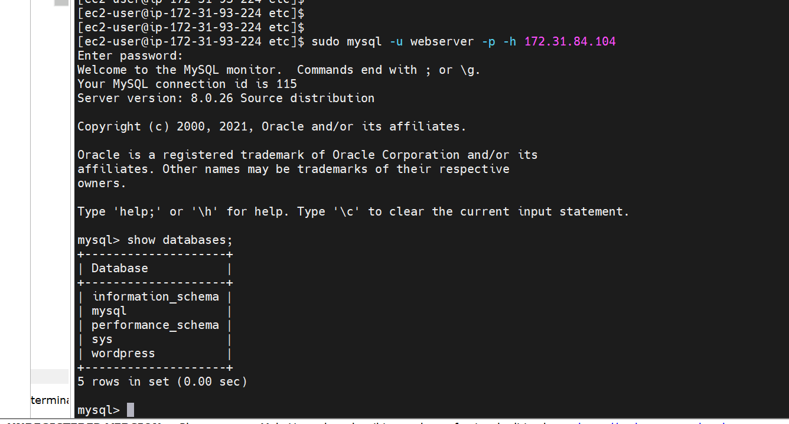

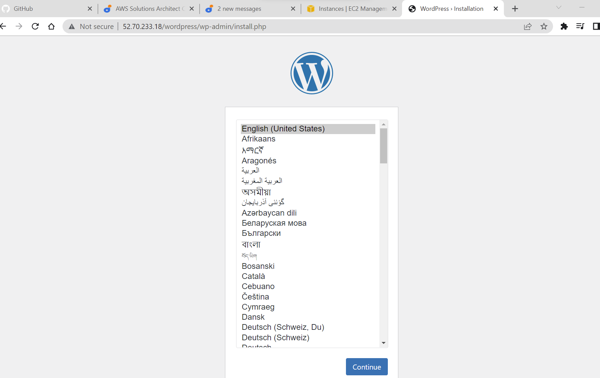