Project7

### Implement a 3 tier web application architecture with a single database and an  NFS serveras a shared files and storage solution that consists of following components:

a.  Infrastructure: AWS
b.  Webserver Linux: Red Hat Enterprise Linux 8
c.  Database Server: Ubuntu 20.04 + MySQL
d.  Storage Server: Red Hat Enterprise Linux 8 + NFS Server
e.  Programming Language: PHP
f.  Code Repository: GitHub

### Step 1 Prepare NFS Server through the listed procedures below 

1.  Spin up a new EC2 instance with RHEL Linux 8 Operating System and provide ssh remote access.
    Then create 2 EBS volume of 8G each and attached it to the Ec2 instance.
    - run `lsblk`  to inspect what block devices are attached a the server
    - run `df -h`  to see all mounts and free space on a server 

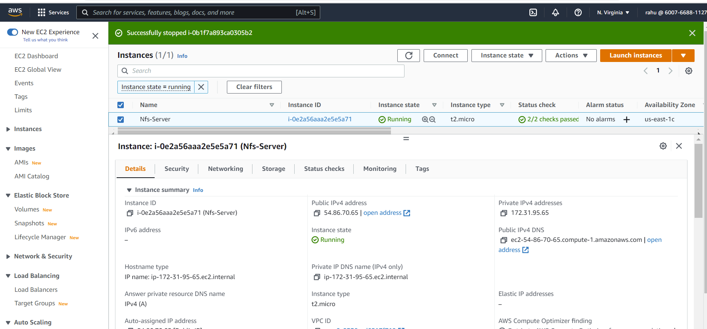

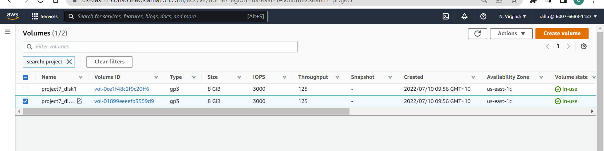

   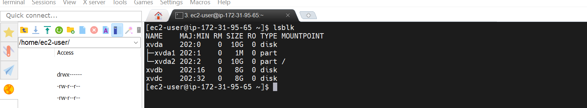

2.  Create a single partition using {cfdisk} on all the newly created storage and LVM as partition type. 
    - run `sudo cfdisk /dev/xvdb` 
    - run `sudo cfdisk /dev/xvdc` 
    - run `lsblk` to view the created partitions
    - run `df -h` to view all mount location  

    

    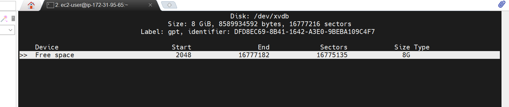

    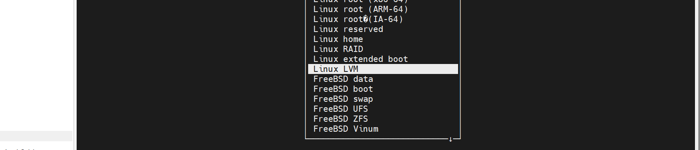

    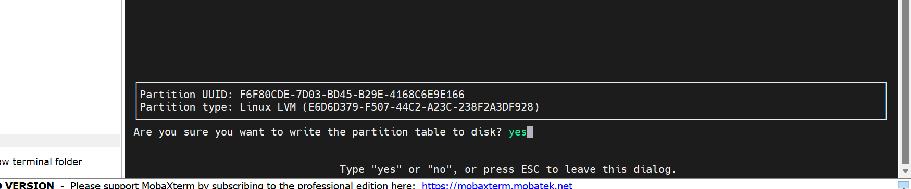

    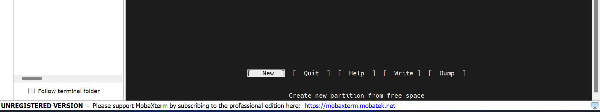
    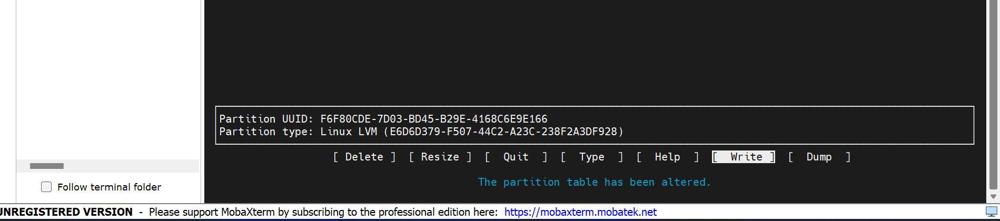
    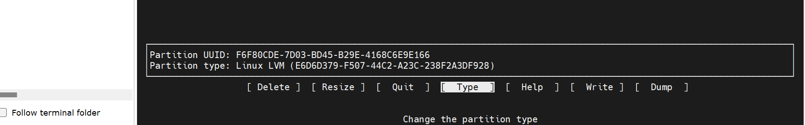

    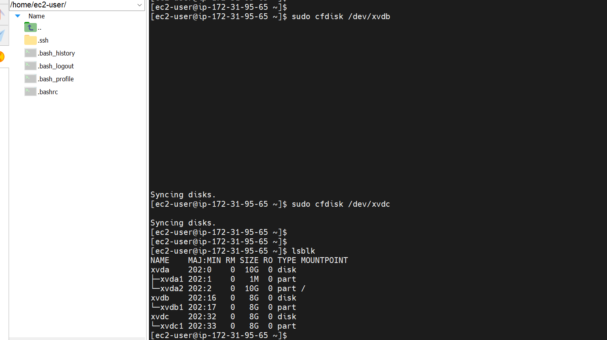

3.  Install lvm2 package and check for available partitions. 
    - run `sudo yum install lvm2` installing the LVM package manager 
    - run `sudo lvmdiskscan`  

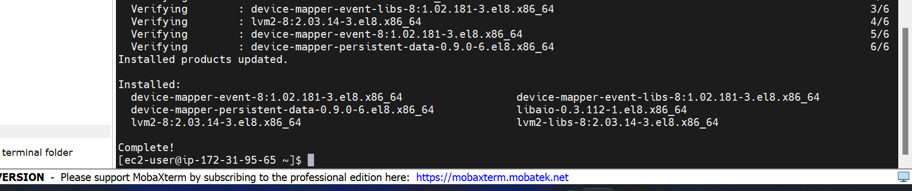

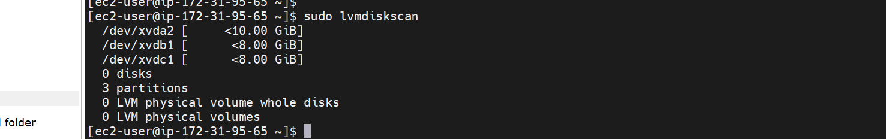

4.  Mark all disks as physical volumes (PVs) to be used by Logical Volume Manager(LVM)
    - run `sudo pvcreate /dev/xvdb1` making physical volume from partiton
    - run `sudo pvcreate /dev/xvdc1` making physical volume from partition

5.  Verify that your Physical volume has been created successfully by running sudo pvs
    - run `sudo pvs` 

  

6.  Use vgcreate utility to add all PVs to a volume group (VG) and name the VG nfs-vg then verify
    that (VG) has been created.
    - run `sudo vgcreate nfsdata-vg /dev/xvdb1 /dev/xvdc1`
    - run `sudo vgs`  
    

7.  Use lvcreate utility to create  3 Logical Volumes. lv-opt, lv-apps and lv-logs. lv-apps and lv-opt
    is used by webservers and lv-log is used by Jenkins.
    - run `sudo lvcreate -n lv-apps -L 5G nfsdata-vg`
    - run `sudo lvcreate -n lv-opt -L 5G nfsdata-vg`
    - run `sudo lvcreate -n lv-logs -L 5G nfsdata-vg`
    - run `sudo lvs`
    - run `sudo vgdisplay -v` view complete setup - VG, PV, and LV
    - run `sudo lsblk`  

8.  Format the logical volumes (LV) with xfs lv-apps, lv-opt and lv-logs
    - run `sudo mkfs -t xfs /dev/nfsdata-vg/lv-apps`
    - run `sudo mkfs -t xfs /dev/nfsdata-vg/lv-opt`
    - run `sudo mkfs -t xfs /dev/nfsdata-vg/lv-logs`  

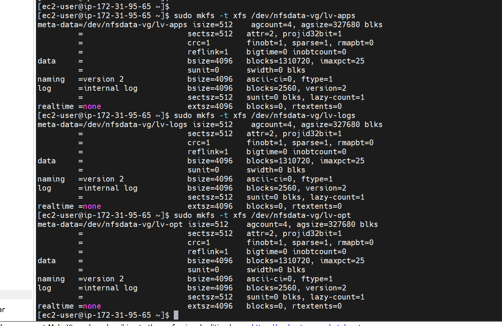

9.  Create mount location /omt on NFS server for Mount `lv-apps on /mnt/apps` – To be used by webservers
    Mount `lv-logs on /mnt/logs` – To be used by webserver logs Mount `lv-opt on /mnt/opt` – To be used by Jenkins server in  Project 8.
    - run `sudo mkdir -p /mnt/apps /mnt/opt /mnt/logs`
    - run `ls /mnt -latr`

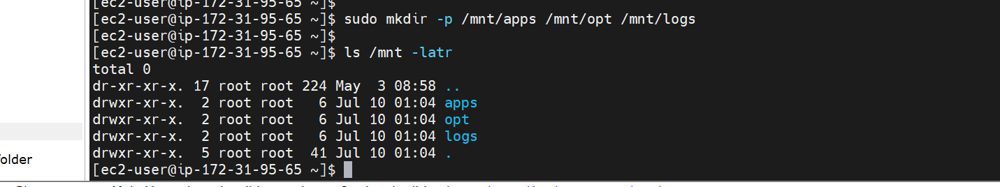

10. Mount LV to the mount location created and update /etc/fstab file so that the mount configuration 
    will persist after restart of the server.
    - run `sudo mount /dev/nfsdata-vg/lv-apps /mnt/apps`
    - run `sudo mount /dev/nfsdata-vg/lv-opt /mnt/opt`
    - run `sudo mount /dev/nfsdata-vg/lv-logs /mnt/logs`
    - run `df -h` to verify the mounts
    - run `sudo blkid`
    - run `sudo vi /etc/fstab` update the blkid and save the file.
- Test the configuration and reload the daemon
    - sudo mount -a
    - sudo systemctl daemon-reload

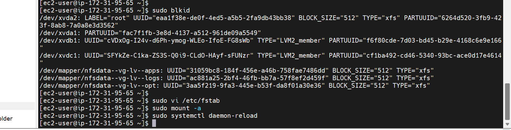

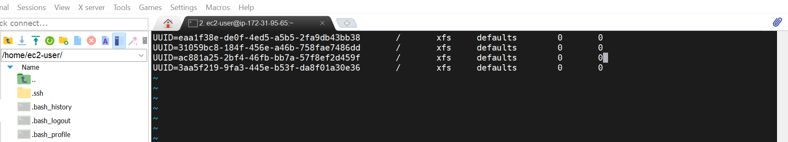

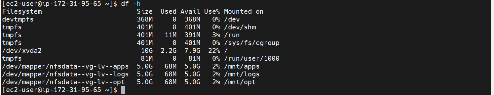

11. Install NFS server, configure it to start on reboot and make sure it is up and running.
    - run `sudo yum -y update`
    - run `sudo yum install nfs-utils -y`
    - run `sudo systemctl start nfs-server.service`
    - run `sudo systemctl enable nfs-server.service`
    - run `sudo systemctl status nfs-server.service`

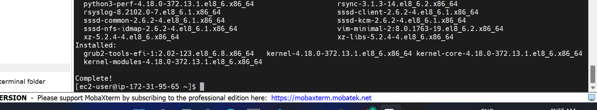

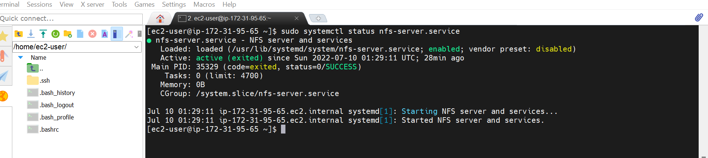

12. Export the mounts for webservers’ subnet cidr to connect as clients. To check your subnet cidr open EC2 details in AWS web console and locate ‘Networking’ tab and open a Subnet link

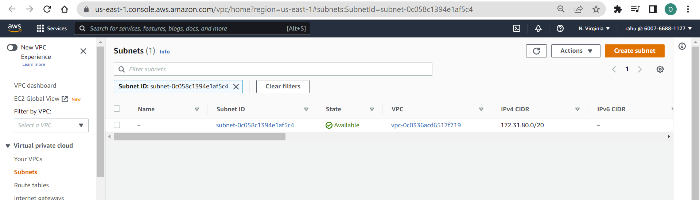

- Set up permission that will allow Web servers to read, write and execute files on the crested NFS server
    - run `sudo chown -R nobody: /mnt/apps` change owner 
    - run `sudo chown -R nobody: /mnt/logs`
    - run `sudo chown -R nobody: /mnt/opt`
    - run `sudo chmod -R 777 /mnt/apps` change permision
    - run `sudo chmod -R 777 /mnt/logs`
    - run `sudo chmod -R 777 /mnt/opt`
    - run `sudo systemctl restart nfs-server.service`

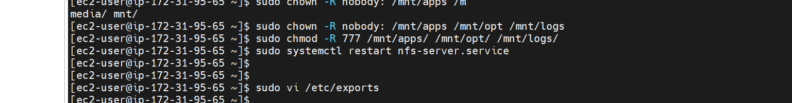

13. Configure access to NFS for clients within the same subnet example of Subnet CIDR {x.x.x.x/xx} 
- run `sudo vi /etc/exports` update below detail in the exports file.

    - `/mnt/apps <Subnet-CIDR>(rw,sync,no_all_squash,no_root_squash)`
    - `/mnt/logs <Subnet-CIDR>(rw,sync,no_all_squash,no_root_squash)`
    - `/mnt/opt <Subnet-CIDR>(rw,sync,no_all_squash,no_root_squash)`
    - Esc + :wq! to exit text editor
    - sudo exportfs -arv

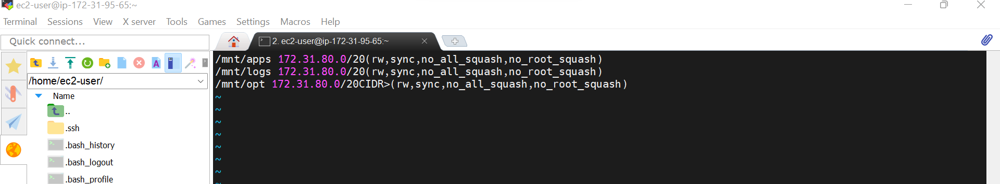

14. Check which port is used by NFS and portmapper. Then open it using Security Groups on the Nfs server
    - run`rpcinfo -p | grep nfs`  

### STEP 2 — CONFIGURE THE DATABASE SERVER

1.   Lunch and Ubuntu Linux OS EC2 instance then install MySQL server and verify installation is up and running.
    - run sudo apt update
    - run sudo apt upgrade
    - run sudo apt install mysql-server
    - run sudo systemctl status mysql
    - run sudo systemctl restart mysql
    - run sudo systemctl enable mysql

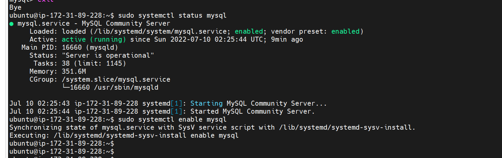

2.  Create a database and name it `tooling` 
    - `sudo mysql`
    - `create database tooling;`

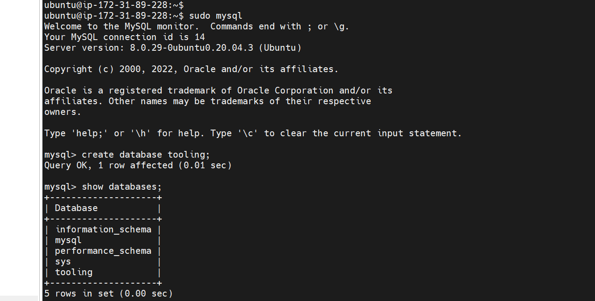

2.  Create a database user and name it webaccess
    - `CREATE USER 'webaccess'@'%' IDENTIFIED BY 'password';`  

3.  Grant permission to webaccess user on tooling database to do anything only from the webservers subnet cidr
    - `GRANT ALL ON tooling.* TO 'webaccess'@'%';`
    - `FLUSH PRIVILEGES;`
    - `SHOW DATABASES;`
    - `exit`

    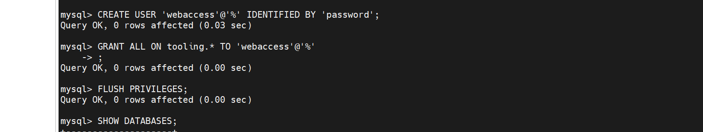

4. Edit the bind address 
    - sudo vi /etc/mysql/mysql.d/msql.cnf
    - run sudo systemctl restart mysql

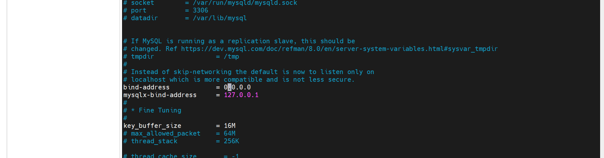
### Step 3 — Prepare the Web Servers

1.  Launch a new EC2 instance with RHEL 8 Operating System  and open TCP port 80 on the Web Server.  

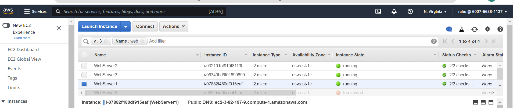

2.  Install NFS client
    - sudo yum install nfs-utils nfs4-acl-tools -y

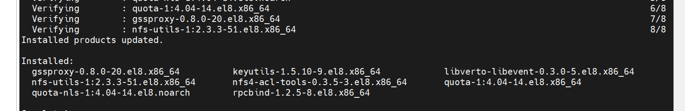

3.  Mount /var/www/ and target the NFS server’s export for apps
    - sudo mkdir /var/www
    - sudo mount -t nfs -o rw,nosuid <NFS-Server-Private-IP-Address>:/mnt/apps /var/www

4.  Verify that NFS was mounted successfully by running df -h. Make sure that the changes will persist on Web Server after reboot
    - df -h
    - sudo vi /etc/fstab  
add following line
    - {NFS-Server-Private-IP-Address}:/mnt/apps /var/www nfs defaults 0 0

5.  Install Remi’s repository, Apache and PHP
    - sudo yum install httpd -y
    - sudo dnf install https://dl.fedoraproject.org/pub/epel/epel-release-latest-8.noarch.rpm
    - sudo dnf install dnf-utils http://rpms.remirepo.net/enterprise/remi-release-8.rpm
    - sudo dnf module reset php
    - sudo dnf module enable php:remi-7.4
    - sudo dnf install php php-opcache php-gd php-curl php-mysqlnd
    - sudo systemctl start php-fpm
    - sudo systemctl enable php-fpm
    - sudo setsebool -P httpd_execmem 1
- Repeat steps 1-5 for another 2 Web Servers.

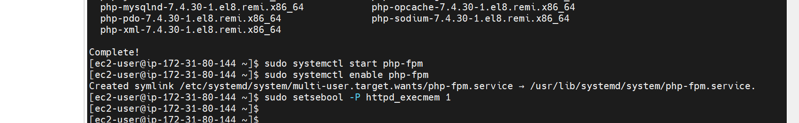

6.  Verify that Apache files and directories are available on the Web Server in /var/www and also on the NFS server in /mnt/apps
    - run on Nfs server sudo ls /mnt/apps
    - run on webserver sudo ls /var/www
    - run on webserver sudo touch /var/www/test.txt
    - run on nfs server ls /mnt/apps

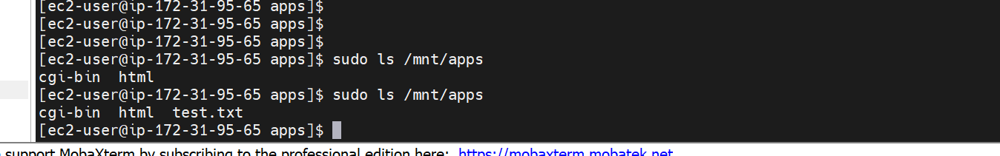

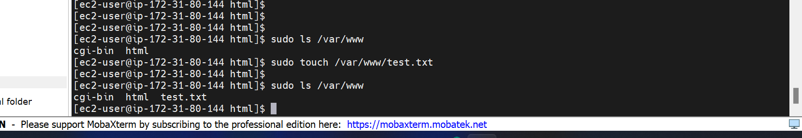

7.  Locate the log folder for Apache on the Web Server and mount it to NFS server’s export for logs. Repeat step №4 to make sure the mount point will persist after reboot.

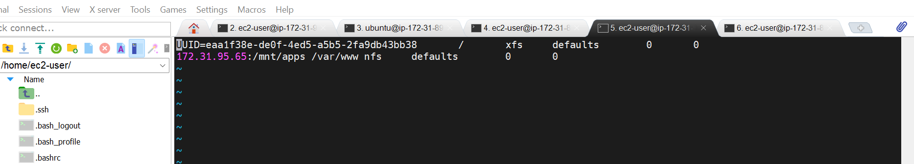

8.  Fork the tooling source code from Darey.io Github Account to your Github account. (Learn how to fork a repo here)
    - sudo yum install git
    - git clone https://github.com/darey-io/tooling.git
    - ls
    - cd tooling
    - ls
    - sudo mv /home/ec2-user/tooling/* /var/www/
    - sudo ls /var/www/html  

 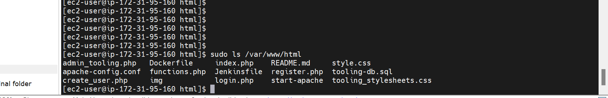

9.  Deploy the tooling website’s code to the Webserver. Ensure that the html folder from the repository is deployed to /var/www/html

    - run sudo ls /var/www/html -latr
    - run  sudo setenforce 0
    - open following config file  /etc/sysconfig/selinux and set SELINUX=disabled then 
    - sudo vi /etc/sysconfig/selinux
    - sudo systemctl restrt httpd  

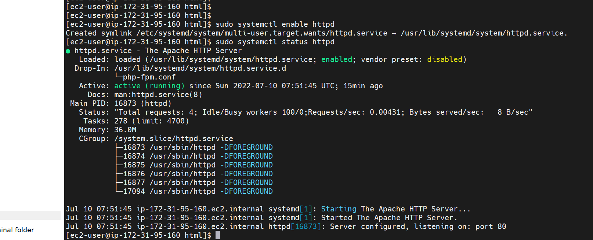  

10. Update the website’s configuration to connect to the database (in /var/www/html/functions.php file). Apply tooling-db.sql script using command   - database using this command mysql -h <databse-private-ip> -u <db-username> -p<db-pasword> < tooling-db.sql
    - sudo yum install mysql (for all webserver)
    - sudo vi /var/www/html/functions.php
    - mysql -h 172.31.89.228 -u webaccess -ppassword < tooling-db.sql
    - sudo systemctl restart httpd
    - sudo systemctl enable httpd
    - sudo systemctl status httpd  
    
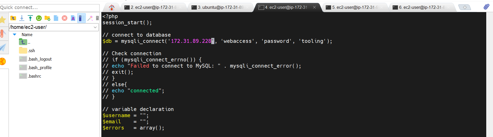
12. Open the website in your browser http://<Web-Server-Public-IP-Address-or-Public-DNS-Name>/index.php and make sure you can login into the websute with myuser user.  

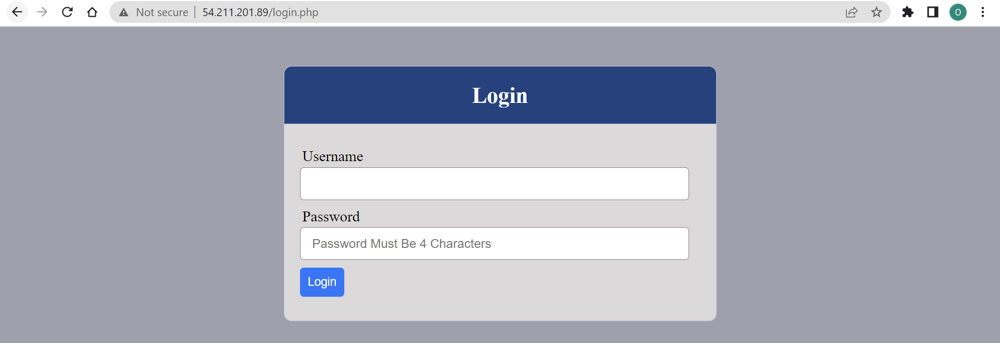

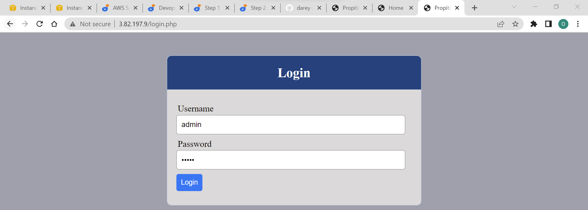

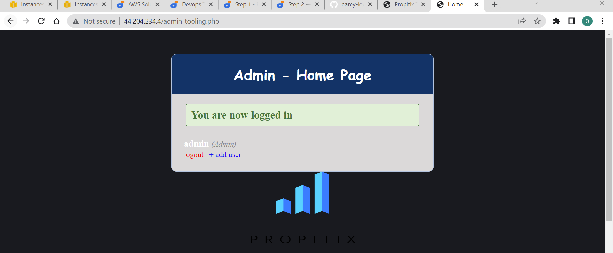