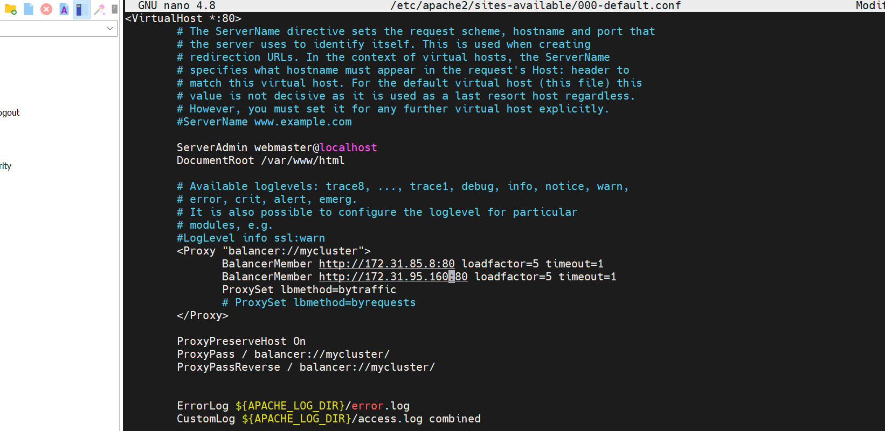

### LOAD BALANCER SOLUTION WITH APACHE
Task
Deploy and configure an Apache Load Balancer for Tooling Website solution on a separate Ubuntu EC2 intance. Make sure that users can be served by Web servers through the Load Balancer.

To simplify, let us implement this solution with 2 Web Servers, the approach will be the same for 3 and more Web Servers.

Prerequisites  
Make sure that you have following servers installed and configured within Project-7:

a.  Two RHEL8 Web Servers  
b.  One MySQL DB Server (based on Ubuntu 20.04)  
c.  One RHEL8 NFS server
d.  apache (httpd) service is up and running on both servers  
e.  /var/www on both Webservers are mounted on /mnt/apps/ on NFS file storage.  
f.  Client browser can access the resource on both webservers using their public IP address or domain name. 

### CONFIGURE APACHE AS A LOAD BALANCER  

1. Create an Ubuntu Server 20.04 EC2 instance and name it Project-8-apache-lb 
2.  Open TCP port 80 on Project-8-apache-lb by creating an Inbound Rule in Security Group. 

3.  Install Apache Load Balancer on Project-8-apache-lb server and configure it to point traffic coming to LB to both Web Servers:  
A. Install apache2 on the instance where load balancer is to be implemented.
    - sudo apt update -y
    - sudo apt upgrade -y
    - sudo apt install apache2 -y
    - sudo systemctl enable apache2
    - sudo systemctl status apache2
    - sudo apt-get install libxml2-dev -y

    B. Enable following modules:  
    - sudo a2enmod rewrite  
    - sudo a2enmod proxy  
    - sudo a2enmod proxy_balancer  
    - sudo a2enmod proxy_http  
    - sudo a2enmod headers  
    - sudo a2enmod lbmethod_bytraffic  

    

    C. Restart apache2 service
    - sudo systemctl restart apache2  
4. Verify that apache is running and up on the Load balancer infastructure
    - sudo systemctl status apache2 

 

5.  Configure load balancing by adjusting /etc/apache2/sites-available/000-default.conf in the load balancer directories.

    - sudo vi /etc/apache2/sites-available/000-default.conf 

    - Add this configuration into this section <VirtualHost *:80>  \</VirtualHost>

        \<Proxy "balancer://mycluster">

        BalancerMember http://{WebServer1-Private-IP-Address}:80 loadfactor=5 timeout=1  
        BalancerMember http://{WebServer2-Private-IP-Address}:80 loadfactor=5 timeout=1  
        ProxySet lbmethod=bytraffic  
        #ProxySet lbmethod=byrequests"  
\</Proxy>

        ProxyPreserveHost On
        ProxyPass / balancer://mycluster/
        ProxyPassReverse / balancer://mycluster/

    - Restart apache server  
        - sudo systemctl restart apache2  

  

6.  Verify that our configuration works 
    - try to access your LB’s public IP address or Public DNS name from your browser: 
    - http://\<Load-Balancer-Public-IP-Address-or-Public-DNS-Name>/index.php  

    

      

### Optional Step – Configure Local DNS Names Resolution

- Open this file on your LB server to add new hosts /etc/hosts
    - sudo nano /etc/hosts

- Add 2 records into this file with Local IP address and arbitrary name to identify the Web Servers
    - \<WebServer1-Private-IP-Address> Web1
    - \<WebServer2-Private-IP-Address> Web2

  

- Now you can update your LB \<config /etc/apache2/sites-available/000-default.conf> file with those names instead of IP addresses.
    - BalancerMember http://Web1:80 loadfactor=5 timeout=1
    - BalancerMember http://Web2:80 loadfactor=5 timeout=1

      

- curl your Web Servers from LB locally curl http://Web1 or curl http://Web2 if you see a html or PHP rendering of of a web page then the solution is up and running. also not that this is local and the DNS can not be resolve by any server both internal and external.

  

