Project9

Task  
Enhance the architecture prepared in Project 8 by adding a Jenkins server, configure a job to automatically deploy source codes changes from Git to NFS server.

## INSTALL AND CONFIGURE JENKINS SERVER  
Step 1 – Install Jenkins server  

1. Create an AWS EC2 server based on Ubuntu Server 20.04 LTS and name it "Jenkins" and also open port 8080.

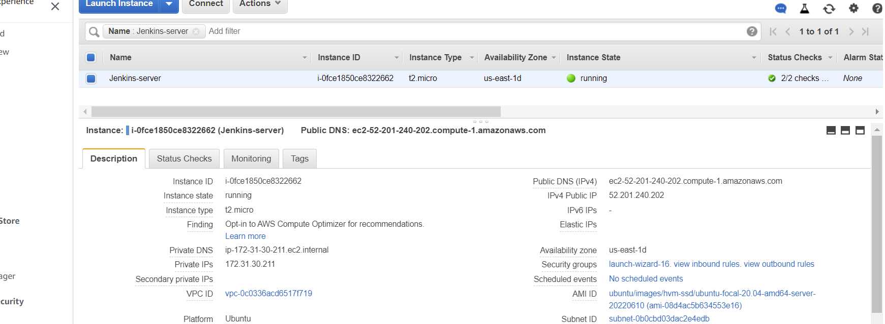  

2.  Install JDK since Jenkins is a Java-based application  
    - sudo apt update  
    - sudo apt install default-jdk-headless  

3.  Install Jenkins  
    - wget -q -O - https://pkg.jenkins.io/debian-stable/jenkins.io.key | sudo apt-key add
    - sudo sh -c 'echo deb https://pkg.jenkins.io/debian-stable binary/ > \ /etc/apt/sources.list.d/jenkins.list'
    - sudo apt update
    - sudo apt-get install jenkins  

4.  Make sure Jenkins is up and running 
    - sudo systemctl status jenkins

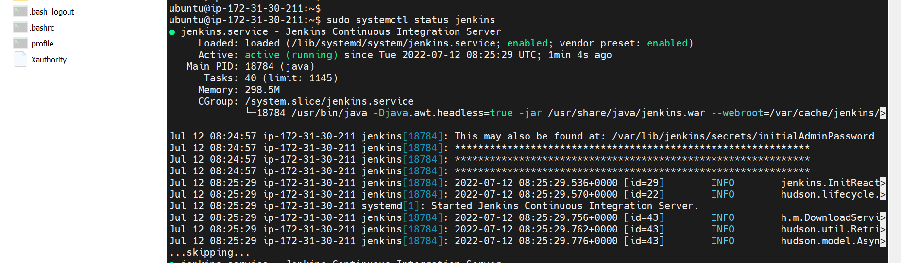  

5.  Perform initial Jenkins setup.  
    - access http://\<Jenkins-Server-Public-IP-Address-or-Public-DNS-Name>:8080  
    - sudo cat /var/lib/jenkins/secrets/initialAdminPassword

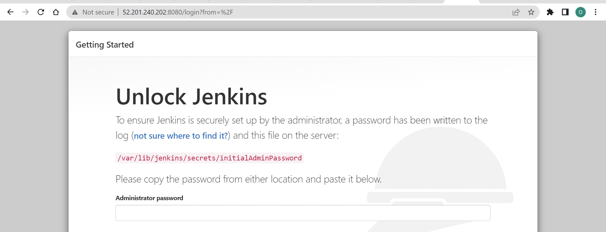

### Step 2 – Configure Jenkins to retrieve source codes from GitHub using Webhooks

1. Enable webhooks in your GitHub repository settings

2. Go to Jenkins web console, click "New Item" and create a "Freestyle project"

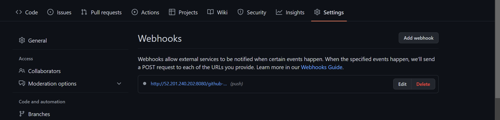  

3. To connect your GitHub repository, you will need to provide its URL, you can copy from the repository itself 

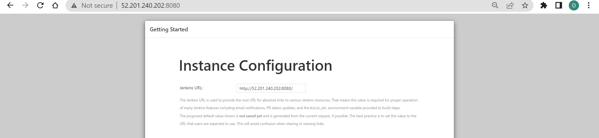

4. In configuration of your Jenkins freestyle project choose Git repository, provide there the link to your Tooling GitHub repository and credentials (user/password) so Jenkins could access files in the repository.  

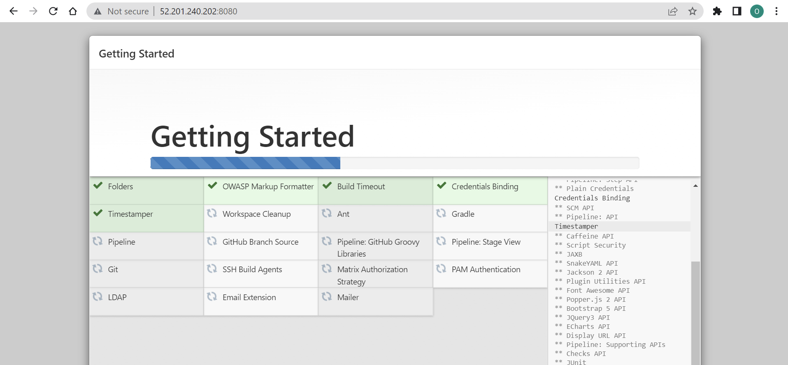

### CONFIGURE JENKINS TO COPY FILES TO NFS SERVER VIA SSH  
Now we have our artifacts saved locally on Jenkins server, the next step is to copy them to our NFS server to /mnt/apps directory.
Jenkins is a highly extendable application and there are 1400+ plugins available. We will need a plugin that is called "Publish Over SSH"  

1. Install "Publish Over SSH" plugin.
    - On main dashboard select "Manage Jenkins" and choose "Manage Plugins" menu item.
    - On "Available" tab search for "Publish Over SSH" plugin and install it 

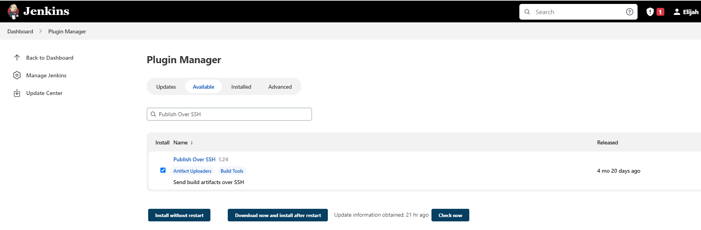
  
2. Configure the job/project to copy artifacts over to NFS server.
    - On main dashboard select "Manage Jenkins" and choose "Configure System" menu item Scroll down to Publish over SSH plugin configuration section and configure it to be able to connect to your NFS server:  
    - Provide a private key (content of .pem file that you use to connect to NFS server via SSH/Putty)
    - Arbitrary name
    - Hostname – can be private IP address of your NFS server
    - Username – ec2-user (since NFS server is based on EC2 with RHEL 8)
    - Remote directory – /mnt/apps since our Web Servers use it as a mointing point to retrieve files from the NFS server  
    - Save the configuration  

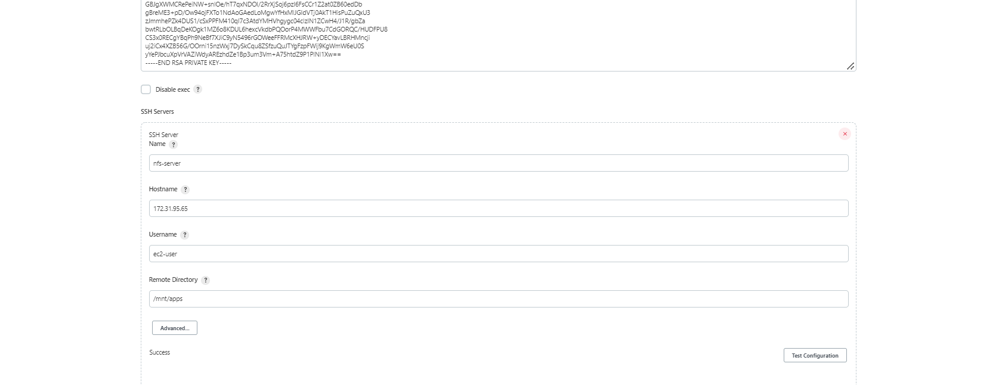

3.  Open Jenkins job/project configuration page and add another configuration "Post-build Action"  
    - Configure it to send all files probuced by the build into our previouslys define remote directory on the NFS-server /mnt/apps/
    - Save this configuration and go ahead, change something in README.MD file in your GitHub Tooling repository
    -Webhook will trigger a new job and in the "Console Output" of the job you will find something like this:  

                            ```SSH: Transferred 25 file(s)
                               Finished: SUCCESS```  

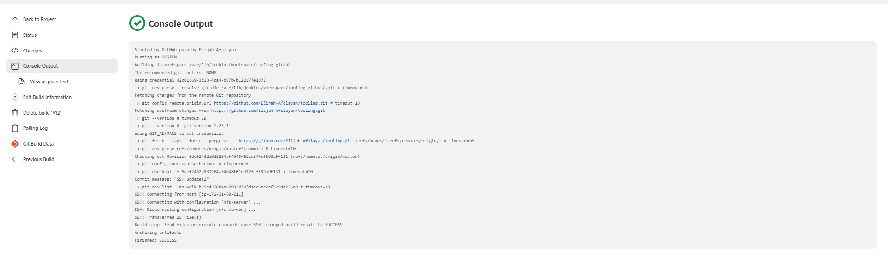

- To make sure that the files in /mnt/apps have been udated – connect via SSH/Putty to your NFS server and check README.MD file
    - cat /mnt/apps/README.md  

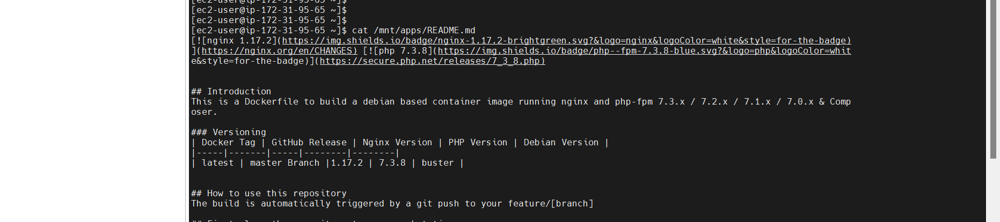  

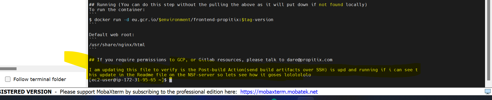

